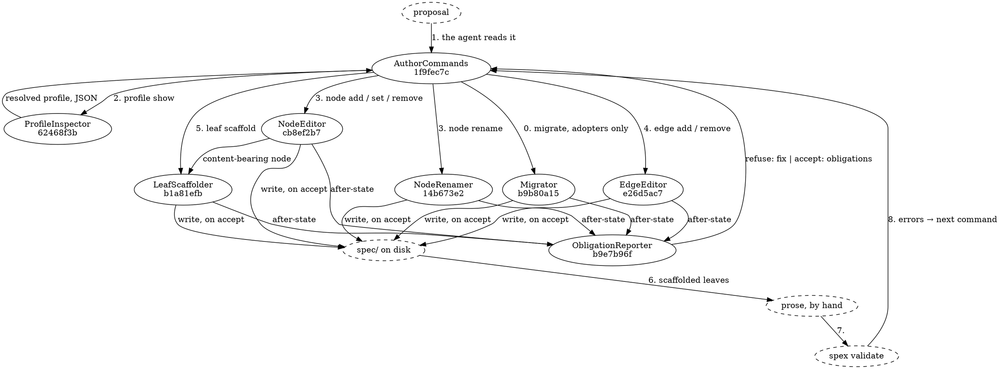

# Authoring flow

How a change proposal becomes a validated spec through the commands, and what moves between the components at each step. The loop is the one the authoring skills run: read the profile, declare, link, scaffold, write prose, validate, apply the fix a refusal names, repeat.

## Data Flow

## The steps

**0. Migrate, adopters only.** A spec from an earlier format version goes through [[b9b80a158949|Migrator]] before anything else: the rename, the removal of undeclared arrays, the version stamp. Its output is a tree the validator accepts as far as format age goes, plus a list of orphaned files by path. A current spec skips this step by running it: the command reports the tree current and writes nothing.

**1–2. Read the profile.** The agent reads the proposal, then runs `spex profile show`. [[62468f3bab3c|ProfileInspector]] hands back the resolved profile as one JSON document — the declared types with plural keys, fields, reference kinds and targets, the coverage chains, and per content-bearing type its content prefix and leaf sections. This is the only place a skill learns a type's name from, which is what keeps the skill ontology-free.

**3. Declare nodes.** Each node in the proposal's impact table becomes one `spex node add`, and [[1f9fec7c42f6|AuthorCommands]] hands the type, name, module and field values to [[cb8ef2b70999|NodeEditor]], which decides file, array, id and content path from the profile. A changed value on a node that exists — a requirement's description, a priority, a pending mark removed — is a `spex node set` to the same worker, which rewrites the entry in place and reports at this step what the change obliges, so that the leaves a description change owes are known here rather than found at step 7. A retired node is a `spex node remove`; a renamed one goes to [[14b673e2a502|NodeRenamer]] as a single transaction and comes back with a retired name for the vocabulary sweep.

**4. Wire edges.** `implements`, `uses`, `describes`, `provided_by`, `preq_id`, `depends_on`, `requires_module`: one `spex edge add` each through [[e26d5ac76610|EdgeEditor]], which checks the target exists, the profile permits the field and target type, and every cycle-checked field stays acyclic.

**5. Scaffold leaves.** Every content-bearing node added in step 3 already has its skeleton from [[b1a81efbd240|LeafScaffolder]]; a node whose leaf was deleted, or an adopter's node that never had one, gets it from `spex leaf scaffold`. The skeleton carries the profile's headings and one placeholder link per owed edge.

**Every write, steps 0 and 3 to 5.** The worker applies the change to an in-memory copy and hands the before-and-after pair to [[b9e7b96f6aa7|ObligationReporter]]. The reporter either refuses — the validator's entries, each with a `fix`, on stdout, nothing on disk — or accepts and returns the leaves the change now obliges, after which the worker writes its after-state to disk. AuthorCommands prints the report; the agent reads the fix or the obligations and issues the next command.

**6. Write prose.** The agent writes into the scaffolded leaves — the one thing in the tree it writes directly — replacing each placeholder link with the sentence that discusses its target and filling the declared sections.

**7–8. Validate and loop.** `spex validate` over the tree. Its errors are the same predicate the reporter applied at each write, so what it can still find is what the prose step introduced or what an obligation left open; each finding becomes the next command, until the report is green and `spex diff` reports `errors: []`.

## Data Shapes

**Into a worker**: a type name, a node name, a module name where the type is module-scoped, and field values keyed by declared field name — or, for a set, an id with field values keyed by declared field name, field names to unset, or both; for edges, a source id, a field name and a target id; for a rename, an id and a new name; for a scaffold, an id. Every id is a 12-character identity hash and every type and field name is looked up in the resolved profile, never matched against a literal in the code.

**Into the reporter**: the tree as read from disk and the tree as the worker left it in memory, plus the resolved profile.

**Out of the reporter**: either a refusal — the validator's entry list, each entry carrying `check`, `message`, `path` and a `fix` — or an acceptance carrying the completeness checker's entry list as `obligations`.

**On stdout**: one JSON document per run. A refusal's error document, or a write report carrying the files written, the `obligations`, for a rename the `retired_name`, and for an edge add that displaced a cardinality-one target the `replaced_target`; for `spex profile show`, the resolved profile itself. Compact when piped, pretty-printed on a terminal.

## Error paths

A refusal at any write leaves the tree byte-identical and exits with the contract-refusal code; the agent applies the fix and reissues. A missing flag or a directory without `project.json` is an input error before any worker runs. A malformed or out-of-range `spec/profile.json` fails every command in this module at resolution with the one message the schema module owns, exactly as it fails `spex validate`. Nothing in this flow reads or writes `.spex/`, so no step can move a baseline, and a session of commands over an uninitialised adopter is the intended first use.
