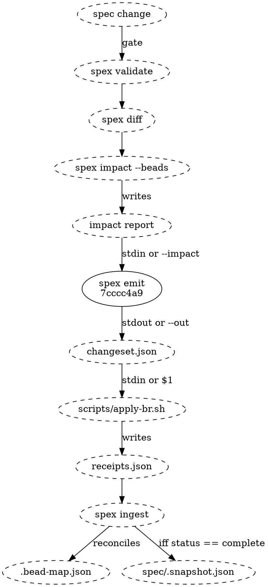

# Emit flow

## Position in the pipeline

Emit sits fourth in a six-stage run, and it is the stage that has to be right
about both of its neighbours: it consumes the impact report the upstream stages
produce, and the changeset it writes is a contract the adapter executes and
`spex ingest` reconciles. Every hand-off from `spex diff` onwards goes through a
file, so each of those stages can be re-run from the artifact its predecessor
wrote. `spex validate` is the exception — it is a gate, not a producer, and
`spex diff` reads only `--snapshot`, `--map` and `--spec-dir` — so restarting at
`diff` means re-reading the spec directory, not a validate artifact.



The one solid node is this module's declared surface; everything dashed is an
invocation or a file on disk. "spec change" is whatever `project.json`,
`module.json` and the markdown leaves now say, and the reference adapter is one
implementation of the adapter contract rather than the contract itself.

A partial run — any op with `status: error` in the receipts — leaves the
snapshot untouched, so the next `spex diff` recomputes from the same baseline
and emit sees only the ops that never landed.

## Emit internals

One invocation, `spex emit --proposal <ref> --git-head <sha> [--impact <file>]`,
runs six steps in this order and writes one file:

1. **Load the inputs.** [[cbe835d38c3e|EmitCommand]] reads the impact report
   from stdin or `--impact`, opens the bead mapping store, loads the spec
   directory, and takes the git HEAD SHA from `--git-head` rather than asking
   git for it.
2. **Partition the create actions by tier.** Tier 0 is the proposal epic, tier 1
   the components and data_flows, tier 2 the multi-component test sections.
3. **Order them.** [[7249fd093b8a|TopologicalSorter]] runs Kahn's algorithm
   inside each tier with a lex tiebreak on `spec_node_id` and hands back the
   create actions in that order. The op ids, and the spec_node_id-to-op_id
   map the later steps need, are assigned from that order by ChangesetBuilder
   once the close ops have been counted.
4. **Label them.** [[6f4b6dd8928f|IdempotencyLabeler]] answers with one label
   per create action: a fresh create takes `spex:<cursor>` and moves the cursor
   on, a cleanup takes `spex:cleanup-<spec_node_id>`, and a modify-pair reuses
   the record id already bound to the bead it replaces.
5. **Resolve the references.** [[f7775ac5f1f3|Resolver]] writes each dep as
   `ref:op`, `ref:bead` or `ref:spec_node`, points every non-epic create's
   parent at the proposal epic, and walks implements → preq_id → priority for
   the op's priority number.
6. **Compose and write.** [[7f06f7d80e94|ChangesetBuilder]] assembles the create
   ops, appends one close op per obsoleted bead carrying the `spex:obsolete` and
   `commit:<HEAD>` labels, and writes `changeset.json` v1 in canonical field
   order to stdout or to `--out`.

Steps 3 and 4 come before step 5 for a reason: a dep can only be written as
`ref:op` once the op it points at has an op_id, and a label can only be reused
once the action it belongs to is known. Ordering settles for the batch as a
whole before the first ref is written; labelling runs per action, each create's
label drawn immediately before that same create's refs.

## Data Shapes

### Impact report (input)

The impact report exactly as the impact module defines it. The field emit exists
to consume is each create action's `dep_spec_node_ids` list: impact names the
spec nodes a new bead should depend on, and emit — not impact — decides how each
of those names is written into the changeset.

### Mapping store reads (input)

Emit reads the mapping store here and writes nothing back to it:

- the records held for a spec node, for the `ref:bead` classification;
- the proposal's epic record, for parent resolution on a re-run;
- the record bound to the bead a modify-pair create replaces, whose id becomes
  that create's label;
- the next record id, which seeds the fresh-create cursor.

The counter behind that last read is never written back here — ingest advances
it once the adapter's receipts say a bead was actually made.

### changeset.json (output)

```json
{
  "version": 1,
  "git_head": "deadbeef...",
  "proposal": "2026-04-18-decouple-spex-from-br",
  "ops": [
    {
      "op_id": "op-1",
      "type": "create",
      "spec_node_kind": "proposal_epic",
      "spec_node_id": "2026-04-18-decouple-spex-from-br",
      "idempotency": { "label": "spex:142" },
      "priority": 3,
      "title": "Proposal: 2026-04-18-decouple-spex-from-br"
    },
    {
      "op_id": "op-2",
      "type": "create",
      "spec_node_kind": "component",
      "spec_node_id": "7f06f7d80e94",
      "idempotency": { "label": "spex:143" },
      "parent": { "ref": "op", "op_id": "op-1" },
      "priority": 1,
      "title": "emit: ChangesetBuilder",
      "body": "…"
    }
  ]
}
```

The epic op has no `body` key, and its absence is the point: an empty body is
omitted from the document rather than written as `""`, and the proposal
reference has no content leaf on disk to describe. The component op beside it
carries one.

## Error Paths

- Impact report has `errors` → abort before loading mapping store. Exit 1.
- Cycle in in-batch deps → abort after sort. Exit 2.
- Missing project requirement in priority chain → default priority `3`, silently. No error, no warning, and nothing in the changeset marks the op.
- `--git-head` missing or malformed → pre-flight rejection before any processing. Exit 1.
