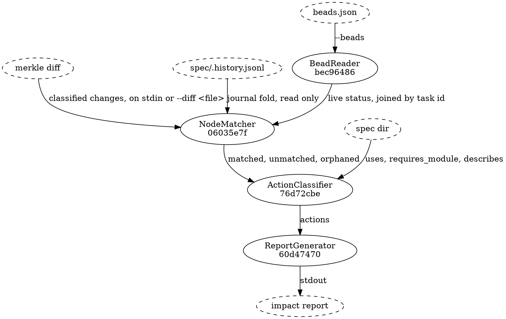
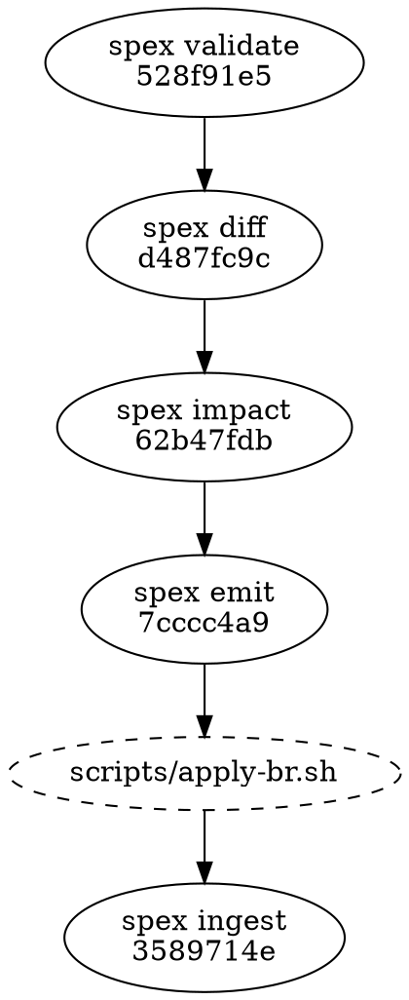

# Impact Analysis Flow

## Data Flow

The four solid nodes are the components this flow is made of; everything dashed is a file or a stream
the flow reads or writes. [[bec96486c6b2|BeadReader]] is the only one of the four that touches tracker
state, and it touches it as a file: the listing the caller redirected into `--beads`, never a command
it ran itself. What it produces is joined onto the fold's pairings by task id, and that join happens in
memory on the way past: this flow reads `spec/.history.jsonl` and never writes it.
[[06035e7f0c39|NodeMatcher]] is handed pairings that already carry a live status, and it passes that
status through untouched. It joins those pairings to the diff's changes on identity hash and splits the
result three ways. [[76d72cbe00f3|ActionClassifier]] turns those three lists into create and obsolete
actions, consulting the spec directory for what the diff cannot tell it — how many components a
test_section describes, which nodes a created bead should depend on, and the readable name to put
against an identity hash in the report. [[60d4747021ec|ReportGenerator]]
groups the actions, counts them, and writes the one document that leaves the command.

## Pipeline Position

Impact sits between merkle diff and the emit → adapter → ingest tail:

Five of the six stages are surfaces this binary declares; the dashed one is the adapter, which runs
outside it. The impact report is the decision document — it shows what will happen before `spex emit`
turns it into a changeset and the adapter executes it. This supports the supervised spec change
workflow: review the impact report, then approve the emit → adapter run.

## Data Shapes

### merkle diff → NodeMatcher input

- ClassifiedChange (as defined in merkle/flow_diff_classification.md)

### BeadReader → NodeMatcher

What BeadReader hands back is one entry per bead, and each entry carries two
things and no more:

  - bead id: the tracker's own id, `spexmachina-abc` and the like
  - status: the bead's live status, exactly as the input reported it

No label is read: the fold's pairing already carries the task id its receipt
recorded, so each entry's status is copied onto the journal fold's pairing
whose task id matches, and it is those enriched pairings — carrying a
`bead_status` alongside the node key they already held — that reach
NodeMatcher. Pairings for which no bead was supplied arrive with that status
unset, and a bead the fold never names joins nothing.

### NodeMatcher → ActionClassifier

Three lists, not one:

  - **matched**: a change paired with every pairing storing its identity hash —
    a spec node may carry more than one bead across its lineage
  - **unmatched**: an added or modified change no pairing refers to, on its
    own — a removed change no pairing refers to reaches none of the three lists
  - **orphaned**: a pairing whose spec node the diff reports as removed, carried
    with the node type of that removed change, because an identity hash does
    not embed one

NodeMatcher forwards `impl_only`, `contract`, and `arch_impl` changes to the
ActionClassifier. It skips `structural` (module.json, project.json, requirement
leaves). Contract-level changes are forwarded — not skipped — but the two node
types merkle classifies as contract-level fare differently past the gate: a
data_flow gets a dedicated task bead, while an api yields none (see the gating
table below).

### ActionClassifier → ReportGenerator

One flat list of actions. Each carries:

  - type: `create` or `obsolete`
  - bead id: the existing bead, on an obsolete; absent on a create
  - module and node: the affected module's name and the affected node's name
  - node type: the affected node's type, carried through from the change — or,
    on the orphaned path, from the removed change that produced the pairing. It
    is the value the gating table below is applied to, on the one path that
    consults it
  - spec node id: the affected node's 12-character hex identity hash
  - spec hash: the node's current merkle content hash, on a create
  - old bead id: on a create replacing an obsoleted bead, the id of the bead it
    replaces; absent on a create for a node that had none
  - dep spec node ids: identity hashes of the spec nodes this action's bead is
    to depend on, collected from component `uses` (direct), transitive
    `requires_module` edges, and — for a component create whose spec node
    appears in a changed data_flow's `uses` array — that data_flow's own
    identity hash, added so the data_flow's create op is ordered first; these
    are spec-graph ids, never bead ids, and resolving them into refs is
    emit's work
  - change type: `modified` or `removed`, on an obsolete; absent on a create
  - reason: one human-readable sentence

Gating rules applied by ActionClassifier:

| node_type | admitted by the gate? |
|-----------|-----------------------|
| module | yes, but no change ever carries this node type, so the entry is dead |
| component | yes (feature) |
| data_flow | yes |
| api | no — declared external surface; the components in its `provided_by` array carry the work |
| test_section, len(describes) >= 2 | yes (task) |
| test_section, len(describes) == 1 | no (bundled with that component's feature bead) |

### ReportGenerator → downstream (emit)

The report is one JSON document with three top-level fields: `creates` and
`obsoletes`, each a list of actions of that type, and `summary`, holding
`create_count` and `obsolete_count`. Nothing else sits at the top level: the
report carries neither a proposal reference nor a generation timestamp, so
there is no field in it a second run could fill differently.

Emit consumes this shape as its input.
