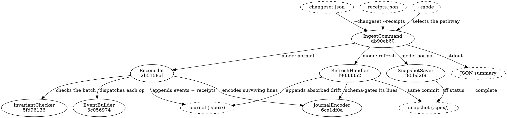

# Ingest flow

`spex ingest` runs in one of two modes, selected by the `--mode` flag and by nothing else. The
dispatch happens inside [[db90eb607bcb|IngestCommand]], which loads the changeset and the receipts
before it looks at the flag, so a malformed artifact fails the same way in either mode. Both modes
protect the same invariant — the snapshot must never describe a spec state the journal has not
caught up with — but they enforce it differently. Normal mode gates the snapshot write on a
complete run and lets the journal run ahead otherwise; refresh mode commits both files under one
boundary and rolls the journal back if the snapshot write fails.



The seven solid nodes are this module's declared components; everything dashed is a flag, a file
on disk or a stream.

## Mode: normal (default)

1. **Pre-flight.** Parse both files, check the changeset carries version 3 and the receipts
   version 1, and confirm the two name exactly the same set of op ids.
2. **Reconcile.** [[2b5158af774b|Reconciler]] assembles the per-run state and dispatches each op
   to [[3c0569749972|EventBuilder]], which constructs the batch's journal lines in memory —
   change events and task receipts, with event ids derived from `(git_head, op_id)` — dropping
   any line whose derived eid its predicate already answers for, in the journal or in the batch
   constructed so far. The changeset's top-level `absorbed` array is constructed in the same
   pass: one `modified` event per entry, eids derived from `(node, before, after)`, closed by one
   `refresh` receipt naming them — not receipt-gated, so absorbed entries land on partial runs
   too. Only once the batch is complete does [[5fd9613616e1|InvariantChecker]] assert the journal
   invariants over what remains; each surviving line is then encoded and schema-validated by
   [[6ce1df0a456b|JournalEncoder]] before the append commits atomically.
3. **Save the snapshot.** [[f85bd2f94aeb|SnapshotSaver]] is handed the receipts' top-level
   status. Anything but `complete` and it writes nothing and reports that it wrote nothing; on
   `complete` it builds the current merkle tree and writes the snapshot atomically.
4. **Report.** One JSON summary on stdout.

## Mode: refresh

The refresh-mode pathway absorbs drift that owes no bead work — content edits to any leaf, plus
additions and removals of the node types that produce no bead (requirements and apis in either
direction) and component *removals* — without any bead lifecycle running, and records the
absorption in the journal. See `arch_refresh.md` for the refusal contract and the absorbable set.

1. **Pre-flight.** Confirm the changeset and receipts carry no ops, and that the journal is
   non-empty — the bootstrap guard: an empty journal means no cycle has ever completed, and the
   first cycle belongs to the normal pipeline; `spex init` writes a snapshot at birth, so file
   presence can no longer stand in for that fact.
2. **Compute the diff.** [[f9033352c13f|RefreshHandler]] rebuilds the current merkle tree, loads
   the pre-refresh snapshot, and diffs one against the other.
3. **Refusal gates.** Any added or removed entry the absorbable set does not cover refuses the
   run, as does any removed node whose journal pairing is still live. A refusal is a structured
   error and leaves both files exactly as they were.
4. **Construct the absorption.** One change event per absorbed drift entry — before/after hashes
   off the two trees — closed by one `refresh` receipt naming those event ids, stamped with
   `--git-head` when given.
5. **Commit.** Append to the journal and write the new snapshot together;
   a failure of the second rolls the first back.
6. **Report.** One JSON summary on stdout.

## Data Shapes

### receipts.json input (mode: normal)

```json
{
  "version": 1,
  "status": "complete",
  "ops": [
    {
      "op_id": "op-0001",
      "status": "ok",
      "bead_id": "spexmachina-abc",
      "was_existing": false
    },
    {
      "op_id": "op-0002",
      "status": "ok",
      "bead_id": "spexmachina-def",
      "was_existing": true
    },
    {
      "op_id": "op-0003",
      "status": "error",
      "bead_id": "",
      "error": "br create exited 1: invalid priority"
    }
  ]
}
```

### receipts.json input (mode: refresh)

Always empty:

```json
{
  "version": 1,
  "status": "complete",
  "ops": []
}
```

The changeset.json passed to refresh mode is similarly empty (`"ops": []`). A non-empty changeset
or receipts file is a configuration error — see `arch_refresh.md`.

### Summary output (mode: normal)

```json
{
  "ok": 11,
  "skipped": 0,
  "errors": 0,
  "events_appended": 8,
  "receipts_appended": 11,
  "snapshot_saved": true,
  "status": "complete"
}
```

### Summary output (mode: refresh)

```json
{
  "events_appended": 2,
  "snapshot_saved": true,
  "status": "complete"
}
```

Refresh has no per-op accounting (no ops). The `status` field is always `complete` on success;
failures return a structured error and no summary.

## Per-Op Construction (mode: normal)

For the full construction table, see `arch_event_builder.md`. Summary:

- ok create → change event plus `task_created`; cleanup creates pair with the `removed` event
  they answer (prior-batch or same-batch), epic creates pair with the proposal's `registered`
  event — every receipt references an event.
- ok create / was_existing=true → same lines constructed; already-present lines (matched by
  derived event id) are dropped, so a true duplicate appends nothing and adapter-side recovery
  appends the missing pairing.
- ok close / reason="Spec node removed" → `removed` event plus `task_closed`.
- ok close / reason starts "Spec node modified" → when a create in the changeset claims the bead,
  the pair's lines — `modified` event, `task_closed`, `task_created` — are built with that create
  and the close adds nothing; when no create in the changeset claims it (the coupled
  `test_section` shape), the close alone builds the `modified` event plus its `task_closed`, no
  `task_created`.
- ok retarget → `modified` event plus `task_retargeted`.
- absorbed entry (no receipt exists for one) → `modified` event, eid from `(node, before, after)`;
  the batch's absorbed events close under one `refresh` receipt naming them.
- error / skipped → nothing.

## Per-Entry Construction (mode: refresh)

- drifted content leaf → one `modified` event with before/after hashes.
- absorbable structural entry → one `added` or `removed` event.
- everything absorbed → one closing `refresh` receipt naming the batch's event ids.
- no drift at all → nothing constructed, neither file written.

## Invariant Check Placement (mode: normal)

Invariants are checked AFTER the whole batch is constructed (in memory), BEFORE the atomic
append. This means a single bad op can block the whole run from committing — all-or-nothing
semantics at the commit level.

## Refusal Gates (mode: refresh)

Refusals are checked AFTER the diff is computed, BEFORE anything is constructed. A refusal returns
the journal and snapshot byte-identical to their pre-call state.

## Error Paths

### Both modes

- Malformed changeset → exit 1.
- Malformed receipts → exit 1.

### Mode: normal

- Missing or extra op_ids → exit 1.
- Invariant failure → exit 2, journal on disk unchanged.
- Snapshot write failure → exit 1, the journal DID append (the journal reflects the adapter's
  real work and the snapshot is regenerable; the re-run appends nothing and completes the
  snapshot).

### Mode: refresh

- Missing pre-refresh snapshot → refused one layer up, before refresh runs: the lifecycle
  pre-flight exits with the not-a-spex-project code, naming `spex doctor`; files unchanged.
- Non-empty changeset or receipts → exit 1, files unchanged.
- Diff carries an added or removed entry outside the absorbable set → exit 2 (structured error),
  files unchanged.
- Live pairing on a removed node → exit 2 (structured error), files unchanged.
- Atomic-write failure of either file → exit 1, both files rolled back to pre-call state.

## Success Paths

### Mode: normal

- Complete run → exit 0, journal appended, snapshot rewritten.
- Partial run → exit 0, journal appended (only ok ops), snapshot unchanged.
- Re-run against same inputs → exit 0, idempotent (nothing appended).

### Mode: refresh

- Drift present → exit 0, events plus receipt appended, snapshot rewritten.
- No drift at all → exit 0, neither file written and `snapshot_saved` reports false, so a refresh
  over an unchanged tree leaves `git status` clean.
- Re-run after a successful refresh → exit 0, nothing appended.
