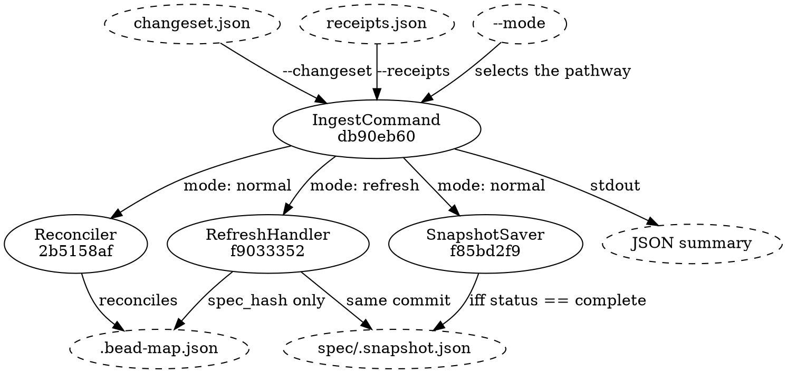

# Ingest flow

`spex ingest` runs in one of two modes, selected by the `--mode` flag and by
nothing else. The dispatch happens inside [[db90eb607bcb|IngestCommand]],
which loads the changeset and the receipts before it looks at the flag, so a
malformed artifact fails the same way in either mode. Both modes protect the
same invariant — the snapshot must never describe a spec state the bead-map
has not caught up with — but they enforce it differently. Normal mode gates
the snapshot write on a complete run and leaves the snapshot standing
otherwise; refresh mode commits both files under one boundary and rolls the
bead-map back if the snapshot write fails.



The four solid nodes are this module's declared components; everything dashed
is a flag, a file on disk or a stream.

## Mode: normal (default)

1. **Pre-flight.** Parse both files, check each carries version 1, and confirm
   the changeset and the receipts name exactly the same set of op ids.
2. **Reconcile.** [[2b5158af774b|Reconciler]] clones the mapping store in
   memory, applies one transition per op, asserts the consistency invariants
   over the result, and only then commits `.bead-map.json` atomically.
3. **Save the snapshot.** [[f85bd2f94aeb|SnapshotSaver]] is handed the
   receipts' top-level status. Anything but `complete` and it writes nothing
   and reports that it wrote nothing; on `complete` it builds the current
   merkle tree and writes `spec/.snapshot.json` atomically.
4. **Report.** One JSON summary on stdout.

## Mode: refresh

The refresh-mode pathway absorbs drift that owes no bead work — content edits
to any leaf, plus additions and removals of the node types that produce no
bead (requirements and apis in either direction) and component
*removals* — without any bead lifecycle running. Typical caller: a follow-up
skill that reads a proposal marked `mode: refresh` and invokes
`spex ingest --mode refresh` with an empty changeset/receipts pair. See
`arch_refresh.md` for the refusal contract and the absorbable set.

1. **Pre-flight.** Confirm the changeset and receipts carry no ops, and that
   `spec/.snapshot.json` exists — it is the diff baseline, and without one
   every leaf would look added.
2. **Compute the diff.** [[f9033352c13f|RefreshHandler]] rebuilds the current
   merkle tree, loads the pre-refresh snapshot, and diffs one against the
   other.
3. **Refusal gates.** Any added or removed entry the absorbable set does not
   cover refuses the run, as does any bead-map record naming a spec node that
   is no longer there. A refusal is a structured error and leaves both files
   exactly as they were.
4. **Update stale hashes.** For each bead-map record, compare the recorded
   `spec_hash` against the current content hash and update it in memory when
   they differ. No other field of any record changes.
5. **Commit.** Write the new `.bead-map.json` and the new
   `spec/.snapshot.json` together; a failure of the second rolls the first
   back.
6. **Report.** One JSON summary on stdout.

## Data Shapes

### receipts.json input (mode: normal)

```json
{
  "version": 1,
  "status": "complete",
  "ops": [
    {
      "op_id": "op-0001",
      "status": "ok",
      "bead_id": "spexmachina-abc",
      "was_existing": false
    },
    {
      "op_id": "op-0002",
      "status": "skipped",
      "bead_id": "",
      "was_existing": false,
      "reason": "already labeled"
    },
    {
      "op_id": "op-0003",
      "status": "error",
      "bead_id": "",
      "error": "bead_cli exited 1: invalid priority"
    }
  ]
}
```

### receipts.json input (mode: refresh)

Always empty:

```json
{
  "version": 1,
  "status": "complete",
  "ops": []
}
```

The changeset.json passed to refresh mode is similarly empty (`"ops": []`).
A non-empty changeset or receipts file is a configuration error — see
`arch_refresh.md`.

### Summary output (mode: normal)

```json
{
  "ok": 10,
  "skipped": 1,
  "errors": 0,
  "records_added": 7,
  "records_updated": 2,
  "records_deleted": 1,
  "snapshot_saved": true,
  "status": "complete"
}
```

### Summary output (mode: refresh)

```json
{
  "records_updated": 2,
  "records_unchanged": 14,
  "snapshot_saved": true,
  "status": "complete"
}
```

Refresh has no per-op accounting (no ops). The `status` field is always
`complete` on success; failures return a structured error and no summary.

## Per-Op Transitions (mode: normal)

For the full transition table, see `arch_reconciler.md`. Summary:

- ok create / was_existing=false → insert record.
- ok create / was_existing=true → no-op when the store already holds that
  record against the same bead; insert when the store has no record at that
  id at all (adapter-side recovery); error when it holds a different bead.
- ok close / reason="Spec node removed" → delete record.
- ok close / reason starts "Spec node modified" → no-op (paired with create).
- error / skipped → no-op.

## Per-Record Transitions (mode: refresh)

- record.spec_hash == current content hash → no change.
- record.spec_hash != current content hash → update record.spec_hash to
  current; all other fields unchanged.
- record for a proposal epic → skipped, whatever its hash says. Its
  spec_node_id is a proposal stem, not a node in the graph.

## Invariant Check Placement (mode: normal)

Invariants are checked AFTER all ops are applied (to the in-memory copy),
BEFORE the atomic commit. This means a single bad op can block the whole
run from committing — all-or-nothing semantics at the commit level.

## Refusal Gates (mode: refresh)

Refusals are checked AFTER the diff is computed, BEFORE any record-level
update is attempted. This means a refusal returns the bead-map and snapshot
byte-identical to their pre-call state.

## Error Paths

### Both modes

- Malformed changeset → exit 1.
- Malformed receipts → exit 1.

### Mode: normal

- Missing or extra op_ids → exit 1.
- Invariant failure → exit 2, `.bead-map.json` on disk unchanged.
- Snapshot write failure → exit 1, `.bead-map.json` DID commit (snapshot
  is regenerable, mapping is not).

### Mode: refresh

- Missing pre-refresh snapshot → exit 1, files unchanged.
- Non-empty changeset or receipts → exit 1, files unchanged.
- Diff carries an added or removed entry outside the absorbable set → exit 2
  (structured error), files unchanged.
- Orphan bead-map record → exit 2 (structured error), files unchanged.
- Atomic-write failure of either file → exit 1, both files rolled back to
  pre-call state.

## Success Paths

### Mode: normal

- Complete run → exit 0, `.bead-map.json` updated, snapshot rewritten.
- Partial run → exit 0, `.bead-map.json` updated (only ok ops), snapshot
  unchanged.
- Re-run against same inputs → exit 0, idempotent (no changes).

### Mode: refresh

- Stale records present → exit 0, `.bead-map.json` updated for stale
  records, snapshot rewritten.
- No drift at all → exit 0, neither file written and `snapshot_saved` reports
  false, so a refresh over an unchanged tree leaves `git status` clean.
- Re-run after a successful refresh → exit 0, no records updated.
