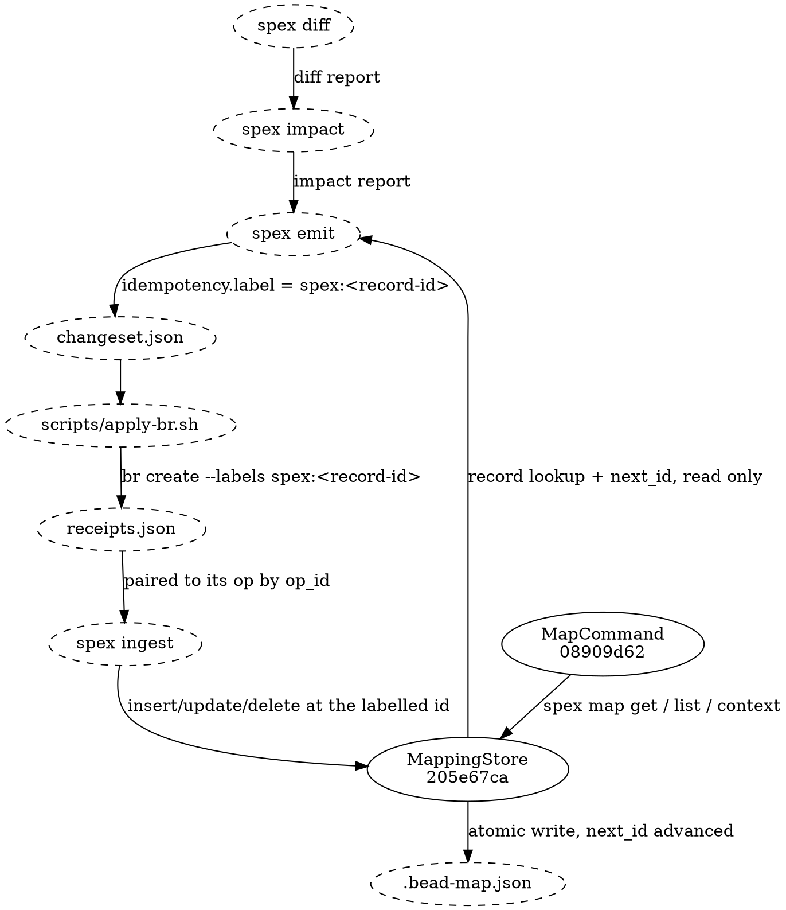

# Bead Creation Mapping Flow

## Data Flow

Mapping records are never written by a bead-creating command inside `spex`.
They are written by `spex ingest` after an external adapter has executed a
changeset against the tracker. The record id travels ahead of the record: emit
allocates it as an op's idempotency label, the adapter applies that label to the
bead it creates, and ingest materialises the record at exactly that id.

[[205e67ca4aad|MappingStore]] appears at both ends of that graph on purpose, and the two edges are
not the same kind of thing. Emit's IdempotencyLabeler only *reads* it — so the ids a changeset hands out are reserved rather
than spent; ingest is the only thing that writes records back, and the persisted counter advances
there or not at all.
Everything between the two is the label doing the travelling: `spex` itself never invokes a bead
CLI, so every tracker mutation happens inside the adapter and every mapping mutation happens inside
ingest. Skills read the settled result through [[08909d62930b|MapCommand]] (`spex map get` / `list`
/ `context`), which is a third kind of edge again — a query face that never writes.

## Lifecycle

### Create (new spec node)

1. `spex impact` classifies the added or modified node as a **create** action.
2. `spex emit` asks IdempotencyLabeler for the op's label. A fresh create takes
   `spex:<cursor>` and advances the in-memory cursor; the persisted `next_id`
   counter is **not** touched by emit.
3. The adapter runs `br create --labels spex:<record-id> --type <bead_type> …`
   and records the new bead id in its receipt. The record-id label is applied at
   create time, not by a follow-up update.
4. `spex ingest` inserts a MappingStore record at `id = parse(idempotency.label)`
   with `spec_node_id` from the op, `bead_id` from the receipt, and the
   remaining metadata resolved from the spec graph.
5. The store's `next_id` counter advances as part of that commit — on any clean
   reconcile, partial or complete, since the ids handed out are spent either
   way. Only the snapshot is gated on completeness: SnapshotSaver writes it only
   when the adapter reported `status = complete` (every op ok or intentionally
   skipped), and skips it on `partial`.

If the adapter reports `was_existing = true` (an open bead already carried the
label), what ingest does depends on the store. If a record already sits at that
id carrying the same bead, the op is a strict no-op — nothing is reconciled,
because the store is already in the target state. If a record sits there
carrying a *different* bead, ingest errors. If there is no record at that id at
all, ingest inserts one: that is the recovery path for an adapter that created
the bead last run and died before writing its receipt.

### Update (modified spec node)

1. `spex impact` classifies a modified node as **obsolete + create**: the old
   bead is closed, a fresh bead replaces it.
2. `spex emit` gives the create op the **same** record-id label as the old
   bead's existing record, found by looking the obsoleted bead's id up in the
   store. The cursor does not advance.
3. The adapter closes the old bead and creates the new one.
4. `spex ingest` sees the close op with reason `"Spec node modified: …"` and
   defers; the paired create op then rebinds that record's `bead_id` to the new
   bead and refreshes `spec_hash`.

Record-id preservation is what makes this an update rather than delete+insert.
The record id is the persistent identity; only `bead_id` and `spec_hash` change.

### Delete (removed spec node)

1. `spex impact` classifies a removed node as **obsolete**.
2. `spex emit` produces a close op with reason `"Spec node removed: …"`.
3. The adapter closes the bead.
4. `spex ingest` deletes the mapping record by `bead_id` match.

If the removed node's bead was already closed, impact additionally classifies a
**cleanup** create. Cleanup beads carry `spec_node_kind = "cleanup"` and the
label `spex:cleanup-<spec_node_id>`; ingest deliberately creates **no** mapping
record for them and the counter does not advance.

## Invariants

Enforced by `Reconciler.AssertInvariants` before the store is committed, and
re-checked on every subsequent run:

- Every ok create has exactly one mapping record — cleanup creates excepted, as
  they have no record by construction.
- Every ok close-on-removed leaves no record behind.
- Every modified-pair record points at the new bead id, not the closed one.
- No orphan records: each record's `spec_node_id` resolves in the spec graph.
  Records with `node_type == "proposal"` are exempt — their `spec_node_id` is a
  proposal reference, not an identity hash.
- No duplicate records for one `spec_node_id` — records whose `node_type` is `proposal` are exempt
  here too, as they are in the orphan check above.
- The snapshot is saved only when receipts are complete, so the bead-map and the
  snapshot always describe the same point-in-time spec state.
- `.bead-map.json` re-validates against the bead-map JSON Schema after every
  reconcile.

A failure at any step leaves the on-disk `.bead-map.json` untouched.

## Data Shapes

### emit → changeset op (the record-id carrier)

- `idempotency.label`: string — `spex:<record-id>` for fresh and modify-pair
  creates, `spex:cleanup-<spec_node_id>` for cleanup creates. This is the only
  channel by which a record id reaches the tracker and returns to ingest.
- `spec_node_kind`: string enum — `proposal_epic` | `component` | `data_flow` |
  `test_section` | `cleanup`. Ingest branches its transition on this value.
- `spec_node_id`: string — 12-char hex identity hash, or the proposal reference
  on `proposal_epic` ops.

### adapter → receipt entry

- `op_id`: string — pairs the receipt back to its op.
- `status`: string enum — `ok` | `skipped` | `error`. Only `ok` advances mapping
  state; `skipped` and `error` are counted and change no record.
- `bead_id`: string — the tracker id created, or the pre-existing one.
- `was_existing`: boolean — true when the idempotency label already matched an
  open bead.

### MappingStore → on-disk format (.bead-map.json)

- MapFile:
  - next_id: integer — monotonic counter for new record IDs, advanced by ingest
  - records: list of MapRecord

- MapRecord:
  - id: integer — record ID; the value carried in the `spex:<id>` bead label
  - spec_node_id: string — 12-char hex identity hash, OR a proposal reference
    when node_type = `proposal`
  - bead_id: string — bead ID from the tracker (e.g., `spexmachina-abc`)
  - bead_type: string — `epic` | `feature` | `task`
  - node_type: string, optional — `proposal` | `component` | `data_flow` |
    `test_section`
  - module: string — module **name** containing the spec node (empty for
    proposal epic records)
  - component: string — component or section name; the proposal reference on
    proposal epic records
  - content_file: string — path to the spec content markdown (empty for
    proposal epic records)
  - spec_hash: string — 64-char hex content hash (empty for proposal epic
    records)
  - bead_status: string, optional — live tracker status when a caller has
    populated it

### MappingStore query interface (CLI `spex map get`)

There is no envelope on this boundary: what crosses it is the record itself. `spex map get` prints
one MapRecord, `spex map list` prints every MapRecord as one JSON array in id order, and neither
wraps the payload in a status object or reports back which identifiers matched nothing. A record
that is not there is a non-zero exit and a line on stderr, never a field in the payload.

No field renames, additions, or removals of these shapes without updating every
consumer: emit's IdempotencyLabeler and ChangesetBuilder, the reference adapter
`scripts/apply-br.sh`, ingest's Reconciler, and the `spex map` CLI command.
