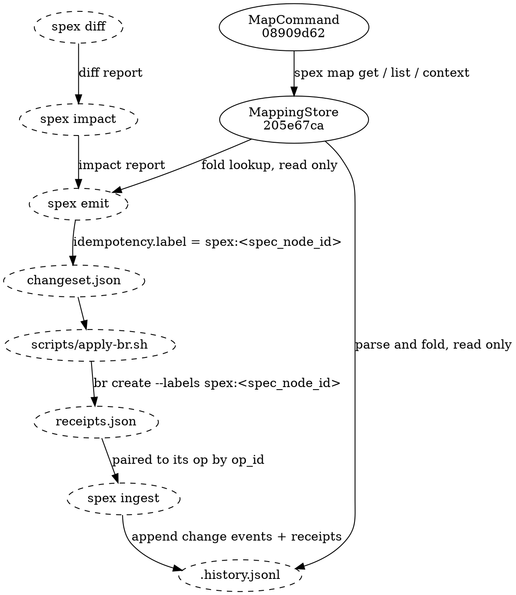

# Bead Creation Mapping Flow

## Data Flow

Journal events are never written by a task-creating command inside `spex`. They are appended by
`spex ingest` after an external adapter has executed a changeset against the tracker. The node's
identity hash travels ahead of the pairing: emit stamps it on the op as the idempotency label, the
adapter applies that label to the task it creates, and ingest appends the change event and its
receipt to the journal at baselining.

[[205e67ca4aad|MappingStore]] reads the journal from two directions on purpose and writes from
neither. Emit's parent-resolution fold reads it before the changeset exists; the map query surface
reads it after ingest has appended. `spex ingest` is the sole writer, and everything between emit
and ingest is the label doing the travelling: `spex` itself never invokes a tracker CLI, so every
tracker mutation happens inside the adapter and every journal mutation happens inside ingest.
Skills read the settled result through [[08909d62930b|MapCommand]] (`spex map get` / `list` /
`context`), a query face that never writes.

## Lifecycle

### Create (new spec node)

1. `spex impact` classifies the added node as a **create** action.
2. `spex emit` labels the op `spex:<spec_node_id>` — the hash comes off the op itself; nothing is
   read, reserved or counted.
3. The adapter runs `br create --labels spex:<spec_node_id> --type <bead_type> …` and records the
   new task id in its receipt. The label is applied at create time, not by a follow-up update.
4. `spex ingest` appends the change event (`added`, with the op's node identity, leaf hashes and
   the changeset's `git_head`) and a `task_created` receipt pairing the event to the task id.
5. The snapshot is written in the same baselining step, only when the adapter reported
   `status = complete`; the journal append and the snapshot describe the same point-in-time state.

If the adapter reports `was_existing = true` (an open task already carried the label), ingest
appends no duplicate: the event id derives from `(git_head, op_id)`, so re-processing the same op
finds its event already present and skips it. That same derivation is the recovery path for an
adapter that created the task last run and died before writing its receipt — the re-run's receipt
pairs with the already-present event.

### Update (modified spec node)

1. `spex impact` classifies a modified node as **obsolete + create**: the old task is closed, a
   fresh task replaces it.
2. `spex emit` gives the create op the same `spex:<spec_node_id>` label — the node's hash has not
   changed, so idempotency needs no lookup and no cursor.
3. The adapter closes the old task and creates the new one.
4. `spex ingest` appends the `modified` change event, a `task_closed` receipt for the old task and
   a `task_created` receipt for the new one. Nothing is rebound: the old pairing stays in the
   journal as lineage, and the fold — latest task-bearing event per node — now answers with the
   new task.

Lineage is what makes this an update rather than an overwrite: every task the node has ever had
remains one journal-history read away — MappingStore's event-history interface, keyed by the same identity hash throughout.

### Delete (removed spec node)

1. `spex impact` classifies a removed node as **obsolete**.
2. `spex emit` produces a close op with reason `"Spec node removed: …"`.
3. The adapter closes the task.
4. `spex ingest` appends the `removed` change event and the `task_closed` receipt. No record is
   deleted, because none exists: the node's biography — name, type, module, removing proposal —
   is now carried by exactly the event just appended, which is what keeps the node resolvable
   after the spec forgets it.

If the removed node's task was already closed, impact additionally classifies a **cleanup**
create. Cleanup tasks carry the label `spex:cleanup-<spec_node_id>`; the hash in that label
resolves against the journal's `removed` event from day one, so a cleanup task is born with
working context instead of a dangling reference.

### Proposal epics

An epic create is synthesized by emit, not born from a diff entry. Its receipt therefore carries
`proposal: <slug>` in place of `for`, its label is `spex:<slug>`, and the fold lists it keyed by
the slug — slug-shaped ids are already the epic convention.

## Invariants

Enforced by the Reconciler before the baselining commit, and re-checked on every subsequent run:

- Every ok create pairs exactly one `task_created` receipt with exactly one change event — cleanup
  creates excepted, as their referent is a prior `removed` event, and epic creates excepted, as
  their referent is a proposal slug.
- Every `task_created` references an existing event or names a proposal — a receipt referencing
  nothing is refused before it is appended.
- Re-running ingest on the same changeset+receipts pair appends nothing: event ids derive from
  `(git_head, op_id)` and receipts pair by the same key.
- The snapshot is saved only when receipts are complete, so the journal and the snapshot always
  describe the same point-in-time spec state.
- Every appended line validates against the journal-line schema before the write happens.

A failure at any step leaves the on-disk journal untouched — the append is a whole-file
write-and-rename, so a refused batch changes nothing.

## Data Shapes

### emit → changeset op (the label carrier)

- `idempotency.label`: string — `spex:<spec_node_id>` for fresh and modify-pair creates,
  `spex:cleanup-<spec_node_id>` for cleanup creates, `spex:<proposal-slug>` for epic creates. This
  is the only channel by which a node's identity reaches the tracker.
- `spec_node_kind`: string enum — `proposal_epic` | `component` | `data_flow` | `test_section` |
  `cleanup`. Ingest branches its event construction on this value.
- `spec_node_id`: string — 12-char hex identity hash, or the proposal reference on `proposal_epic`
  ops.

### adapter → receipt entry

- `op_id`: string — pairs the receipt back to its op, and (with `git_head`) derives the event id.
- `status`: string enum — `ok` | `skipped` | `error`. Only `ok` produces journal receipts;
  `skipped` and `error` are counted and append nothing.
- `bead_id`: string — the tracker id created, or the pre-existing one.
- `was_existing`: boolean — true when the idempotency label already matched an open task.

### journal line shapes (spec/.history.jsonl)

- Change event: `event` (`added`|`removed`|`modified`), `eid`, `node`, `name`, `node_type`,
  `module`, `before`, `after`, `git_head`, `proposal`.
- Task receipt: `event` (`task_created`|`task_closed`), `for` (an `eid`) or `proposal` (a slug,
  epics only), `task_id`.
- Refresh receipt: `event` (`refresh`), `git_head` (or recorded absence), `absorbed` (a list of
  `eid`s).

No field renames, additions, or removals of these shapes without updating every consumer: emit's
IdempotencyLabeler and Resolver, the reference adapter `scripts/apply-br.sh`, ingest's Reconciler,
and the `spex map` CLI surface.
