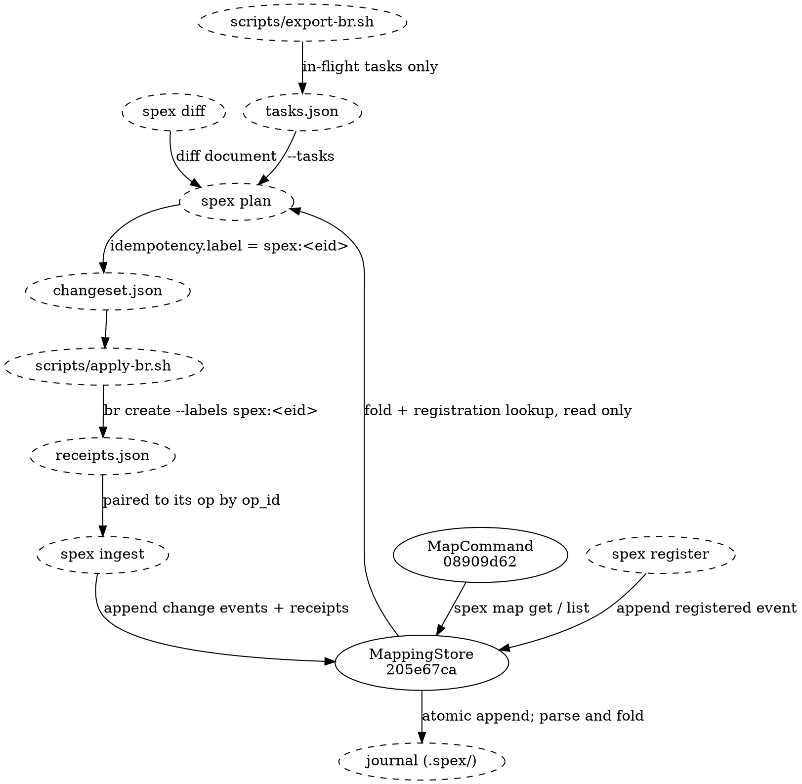

# Task Creation Mapping Flow

## Data Flow

Journal events are never written by a task-creating command inside `spex`. They are appended
through the store's writer-owner primitive — by `spex ingest` after an external adapter has
executed a changeset against the tracker, and by registration when a proposal's lifecycle opens.
The journal event id travels ahead of the pairing: plan derives each create op's eid from
`(git_head, op_id)` — the same derivation ingest will use to mint the event — and stamps it on
the op as the `spex:<eid>` idempotency label; a retarget op carries the same derivation's eid as
a plain label for the task it moves. An adapter that implements the optional label surface
applies it to the task it creates or updates — insurance, not linkage — and ingest appends the
change event and its receipt to the journal at baselining.

[[205e67ca4aad|MappingStore]] sits on both sides of the journal on purpose: it answers every read
and it owns the one append primitive every writer uses. Plan's parent resolution reads it before
the changeset exists — the fold for pairings, the parsed events for the run's registration; the
map query surface reads it after ingest has appended; `spex
ingest` and registration append through it. Everything between plan
and ingest is the eid doing the travelling — in the changeset and receipts always, on tracker
labels only where an adapter applies them: `spex` itself never invokes a tracker CLI, so every
tracker mutation happens inside the adapter and every journal mutation happens inside the store.
The tracker's view enters the run through one bounded document, the task-state artifact the
adapter's export half writes: in-flight tasks and their statuses, nothing more. The journal
never carries that status — a task's liveness is read fresh every run and remembered nowhere.
Skills read the settled result through [[08909d62930b|MapCommand]] (`spex map get` / `list` /
`context`), a query face that never writes.

## Lifecycle

### Create (new spec node)

1. `spex plan` classifies the added node as a **create** action and labels the op `spex:<eid>`,
   deriving the eid from `(git_head, op_id)` exactly as ingest will mint the event — nothing is
   read, reserved or counted.
2. The adapter runs `br create --labels spex:<eid> --type <br-type> …`, where `<br-type>`
   is `spec_node_kind` mapped through the adapter's fixed table (`component` → `feature`,
   everything else task-shaped → `task`, `proposal_epic` → `epic`), and records the new task id in
   its receipt. The label is applied at create time, not by a follow-up update.
3. `spex ingest` appends the change event (`added`, with the op's node identity, leaf hashes and
   the changeset's `git_head`) and a `task_created` receipt pairing the event to the task id.
4. The snapshot is written in the same baselining step, only when the adapter reported
   `status = complete`; the journal append and the snapshot describe the same point-in-time state.

If the adapter reports `was_existing = true` (a task already carried the label, in any status),
the event id
— derived from `(git_head, op_id)` — decides which of two things happens. Usually the journal
already holds the pairing from the run that made it, the derived eid matches, and ingest appends no
duplicate. The recovery case is the opposite: an adapter that created the task last run and died
before writing its receipt leaves no pairing in the journal at all, so this run's event and receipt
are genuinely new — they land now, pairing the event with the task the dead run already made.

### Retarget (modified spec node, task still open)

1. `spex plan` classifies a modified node whose pairing's task the artifact lists as open and
   unclaimed as a **retarget**: no task is closed, none created — the task's target moves to the
   node's new state. The op carries `spex:<eid>` of this run's `modified` event in its `labels`,
   and the task's recomputed deps.
2. The adapter runs `br update` against the target task: it adds the new event label and any deps
   the task does not already carry. Updates are naturally idempotent, so no probe precedes them.
3. `spex ingest` appends the `modified` change event and a `task_retargeted` receipt pairing it
   to the existing task id. No `task_closed`, no `task_created`.
4. The fold — latest task-bearing event per node, `task_created` and `task_retargeted` alike —
   now answers with the same task id sourced from the newer event, and the context bracket for
   the task widens: `before_head` stays at the task's original birth, `after_head` moves to the
   latest retargeted event, so the implementer sees the whole accumulated change.

A modified node whose pairing is `in_progress` retargets nothing: `spex plan` refuses the run,
naming every claimed task whose node changed. A claimed task's target never moves under it.

### Successor (modified spec node, task finished)

1. `spex plan` classifies a modified node whose pairing's task is absent from the task-state
   artifact — finished — as a plain **create**: the shipped task stays as it is, a fresh task
   carries the new work. No close op is issued against the finished task, and the create names
   it nowhere: no old-task field, no lineage dependency.
2. The create op gets a fresh `spex:<eid>` label — the eid derives from this run's
   `git_head` and the op's id, so every change in the node's lineage carries its own label and
   the finished predecessor's label can never collide with it. Idempotency still needs no lookup
   and no cursor.
3. The adapter creates the new task, exactly as it would for a new node.
4. `spex ingest` appends the `modified` change event — it reads the node's prior state off the
   journal, since the op does not say whether the node is new — and a `task_created` receipt for
   the new task. Nothing is rebound and nothing is closed: the old pairing stays in the journal
   as lineage with no `task_closed` after it, and the fold now answers with the new task.

Lineage is what makes this a successor rather than an overwrite: every task the node has ever had
remains one journal-history read away — MappingStore's event-history interface, keyed by the same
identity hash throughout. No edge connects generations in the tracker on any path — the history
is the journal's alone, and `spex map context`'s bracket is how an implementer reads it.

### Delete (removed spec node, task still open)

1. `spex plan` classifies a removed node whose pairing's task the artifact lists as open as a
   **close** and produces a close op with reason `"Spec node removed: …"` — cancelling live work
   is a real action.
2. The adapter closes the task.
3. `spex ingest` appends the `removed` change event and the `task_closed` receipt. No record is
   deleted, because none exists: the node's biography — name, type, module, removing proposal —
   is now carried by exactly the event just appended, which is what keeps the node resolvable
   after the spec forgets it.

A removed node whose pairing is `in_progress` closes nothing: `spex plan` refuses the run, the
same protection a modified node's claimed task has.

### Cleanup (removed spec node, task finished)

If the removed node's task is absent from the artifact, plan classifies a **cleanup** create
instead of a close — the code shipped, and something must now delete it. A cleanup task carries
`spex:<eid>` of the removal event it answers: the journal's latest change event for the node when
that is already a removal, else the `removed` event the cleanup op itself mints from its own
`(git_head, op_id)`, because no close accompanies it to mint one. Its `task_created` references
that same event, so the cleanup task is born with working context instead of a dangling
reference: its task id resolves through the journal to the removed node's biography. The finished
task the node had gets no `task_closed`; it stays in the journal as the pairing the removal
superseded.

### Absorb (marked cosmetic modification)

A node the run's absorb list marks produces no op and no tracker mutation at all. Its `modified`
event still reaches the journal: ingest mints it from the changeset's `absorbed` array — eid
derived from `(node, before, after)`, exactly as refresh-born events are — and closes it with the
existing `refresh` receipt naming it. The fold is untouched by design: a `refresh` receipt is not
task-bearing, so the node's pairing keeps its sourcing event and the task owes nothing.

### Proposal epics

An epic create is synthesized by plan, not born from a diff entry. Its referent is the
`registered` event registration appended when the proposal's lifecycle opened: plan reads that
event's eid (`<git_head>:<slug>`) from the parsed journal, labels the op `spex:<eid>`, and the
epic's `task_created` references the registered event through `for` like every other receipt.
The read is on the events, not on the fold, because until that receipt lands the registration
pairs with no task and the fold — a list of task-bearing pairings — carries nothing for it. Once
it lands, the fold lists the epic keyed by the slug the registered event carries. Legacy epic receipts that carry
`proposal: <slug>` in place of `for` remain readable behind the fold's read-only legacy branch.

## Invariants

Enforced by ingest before the baselining commit, and re-checked on every subsequent run:

- Every ok create pairs exactly one `task_created` receipt with exactly one referent event — the
  change event for node-bearing creates, the `removed` event for cleanup creates, the
  `registered` event for epic creates. Every ok retarget pairs exactly one `task_retargeted`
  receipt with its own `modified` event.
- Every receipt references an existing event — a receipt referencing nothing is refused
  before it is appended. The retired "or names a proposal" branch survives only as inert legacy
  lines behind the fold's read-only legacy branch.
- Re-running ingest on the same changeset+receipts pair appends nothing: event ids derive from
  `(git_head, op_id)` and receipts pair by the same key.
- The snapshot is saved only when receipts are complete — SnapshotSaver's gate, not Reconciler's —
  so the journal and the snapshot always describe the same point-in-time spec state.
- Every appended line validates against the journal-line schema before the write happens.

Nothing demands a `task_closed` between generations: a node with several `task_created` lines and
no close between them is the ordinary record of finished work followed by new work.

A failure at any step leaves the on-disk journal untouched — the append is a whole-file
write-and-rename, so a refused batch changes nothing.

## Data Shapes

### adapter → task-state artifact (plan's tracker input)

- `version`: integer, always `1`.
- `tasks[].task_id`: string — the tracker's own id, the same value receipts and journal receipts
  carry, so the join onto a pairing is a string comparison.
- `tasks[].status`: `open` | `in_progress`. Nothing else is admitted, and a task not listed has
  no live work. See `spec/schema/arch_task_state_schema.md`.

### plan → changeset op (the label carrier)

- `idempotency.label`: string, on creates — `spex:<eid>` of the journal event the op's
  `task_created` will reference: the change event for node-bearing creates, the removal
  event the cleanup answers for cleanup creates, the `registered`
  event for epic creates. One rule, no shape branching. On a retarget the same derivation rides
  in `labels` instead, because an update needs no probe. This is the only channel by which an
  event's identity reaches the tracker.
- `spec_node_kind`: string enum, on creates — `proposal_epic` | `component` | `data_flow` |
  `test_section` | `cleanup`. Ingest branches its event construction on this value; retarget ops
  carry the op type itself as the discriminator.
- `spec_node_id`: string — 12-char hex identity hash, or the proposal reference on `proposal_epic`
  ops.

### adapter → receipt entry

- `op_id`: string — pairs the receipt back to its op, and (with `git_head`) derives the event id.
- `status`: string enum — `ok` | `skipped` | `error`. Only `ok` produces journal receipts;
  `skipped` and `error` are counted and append nothing.
- `task_id`: string — the tracker id created, updated, or the pre-existing one.
- `was_existing`: boolean — true when the idempotency label already matched a task, in any
  status. Not applicable to retargets.

### journal line shapes (the task journal)

- Change event: `event` (`added`|`removed`|`modified`), `eid`, `node`, `name`, `node_type`,
  `module`, `before`, `after`, `git_head`, `proposal`, and an optional `path` — the node's
  content-leaf path, present when the node has one.
- Registered event: `event` (`registered`), `eid` (`<git_head>:<slug>`), `proposal`, `git_head` —
  no `node`, because registration precedes any spec change.
- Task receipt: `event` (`task_created`|`task_closed`|`task_retargeted`), `for` (an `eid`),
  `task_id`. A `proposal` slug in place of `for` is a legacy pre-migration shape, read but never
  appended anew.
- Refresh receipt: `event` (`refresh`), `git_head` (or recorded absence), `absorbed` (a list of
  `eid`s) — closing refresh-born and absorb-born `modified` events alike.

No field renames, additions, or removals of these shapes without updating every consumer: plan's
IdempotencyLabeler and Resolver, the reference adapter's two scripts, ingest's Reconciler,
and the `spex map` CLI surface.
