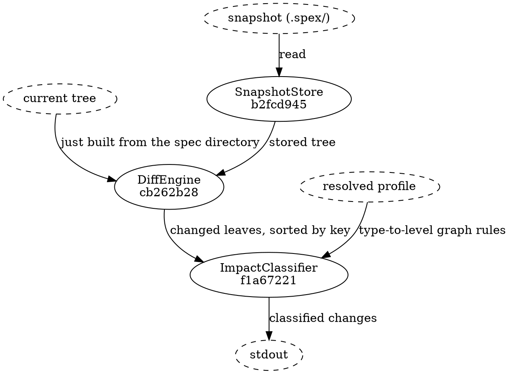

# Diff and Classification Flow

## Data Flow

The three solid nodes are the components this flow is made of; everything dashed is a file or a
stream. [[b2fcd9457a28|SnapshotStore]] contributes one of the two trees and nothing else — it reads
the stored snapshot and hands it over; where that file is absent it is not invoked at all and
DiffEngine is handed no second tree. [[cb262b280963|DiffEngine]] compares the two and emits one entry per leaf whose content hash
moved, in ascending key order. [[f1a672216ce9|ImpactClassifier]] adds a level to each of those entries
and replaces the owning module's identity hash with that module's name; it drops nothing and reorders
nothing, so the list handed on is the diff's own list, one field longer and reporting the module by
name rather than by hash. How much of each entry survives onto stdout depends on the output format —
see `## Output` below.

## Input

- Current merkle tree (just built from spec directory)
- Stored snapshot (loaded from the snapshot file at its resolved location inside `.spex/`)
- Resolved profile (resolved once by the diff command — `spec/profile.json` when present, the built-in default otherwise — and handed to ImpactClassifier as its third input; the classifier reads no file itself)

## Output

A list of classified changes. The two output formats print different amounts of each one.

`spex diff --json` carries seven fields per change, the last three dropped from the object when they
are empty:
- The identity hash of the changed spec node — the merkle key, not a file path
- Change type (added/removed/modified)
- Impact level (impl_only/contract/arch_impl/structural, or unknown for a node type the resolved profile does not declare)
- Module name
- Node type
- The leaf's previous content hash, omitted on an addition
- The leaf's new content hash, omitted on a removal

The default text format prints one line per change carrying four of those, in the column order
change type, impact level, module name, identity hash. The node type and the two content hashes are
on the JSON path only; a caller that needs them must ask for `--json`.

This output feeds directly into the plan module for bead matching.

## Data Shapes

### SnapshotStore → DiffEngine

- Snapshot:
  - nodes: map keyed by node.key (identity_hash or `meta/*`) → Node
    (Node shape as defined in flow_hash_computation.md)
  - root_hash: string, 64-character lowercase hex

Both `current` and `previous` Snapshots have the same shape. The diff algorithm
treats missing keys as added/removed and matching keys with different hashes as
modified.

### DiffEngine → ImpactClassifier

- Change:
  - key: string — identity_hash or `meta/*`
  - node_type: string — a type name the resolved profile declares, or `meta` for
    envelope leaves. The vocabulary is open per profile: the default profile
    declares `component` | `requirement` | `data_flow` | `test_section` | `api`,
    and a profile-declared type contributes its declared name. A removed leaf
    carries whatever the snapshot recorded, so a value outside the current
    profile's declarations is reachable here
  - module: string — identity_hash of the parent module, empty for project-level
  - change_type: string enum — `added` | `removed` | `modified`
  - old_hash: string, 64-char hex (empty for added)
  - new_hash: string, 64-char hex (empty for removed)

The classifier's second and third inputs travel alongside: the module identity
hash → name map read off the freshly built tree, and the resolved profile whose
graph rules carry the type-to-level mapping.

### ImpactClassifier → downstream

- ClassifiedChange: Change plus
  - impact_level: string enum — `impl_only` | `contract` | `arch_impl` |
    `structural`, or `unknown` for a node_type the resolved profile does not
    declare (and that is not `meta`)
  - module: string — the module's name, in place of the identity hash the Change
    arrived with; empty for project-level changes, and the identity hash itself
    when no name is known for it

The mapping from declared node type to level is the resolved profile's
graph-rules declaration, joined by the frame's one fixed rule — `meta` is always
`structural`. The default profile's assignment:

| node_type   | impact_level |
|-------------|--------------|
| test_section | impl_only |
| data_flow, api | contract     |
| component   | arch_impl    |
| meta, requirement | structural |

The `contract` level is a surface shared beyond a single component: for a
data_flow, a cross-component shape inside a module; for an api, a surface the
module declares to its callers. Downstream matchers MUST NOT skip it — a
data_flow change must reach the action classifier so a dedicated data_flow task
bead is created.
