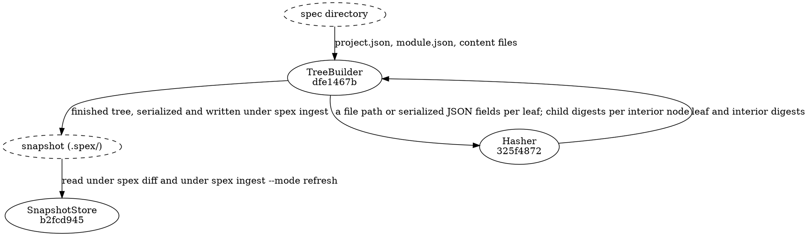

# Hash Computation Flow

Nothing in this flow is a command of its own. [[dfe1467b7a4b|TreeBuilder]] walks the spec directory
and asks [[325f48728e04|Hasher]] for a digest at every node it creates; the tree that comes back is
what `spex ingest` serializes into the project's snapshot file, and [[b2fcd9457a28|SnapshotStore]] is what
reads that file back. The composition is invoked *inside* `spex diff` (and inside `spex ingest`'s
SnapshotSaver path) — there is
no standalone `spex hash` command. This is intentional: a separate hash step
either produces a snapshot that matches the current spec (so the next `spex
diff` reports no changes and the pipeline stalls) or it desynchronises the
snapshot from the task journal (breaking the snapshot+journal atomicity
invariant). Building the tree on demand inside `diff` and only persisting it
through `ingest` keeps both invariants intact.

## Data Flow

TreeBuilder is the one that knows the shape of the spec directory: it discovers the modules from
`project.json` and the leaves from each `module.json`, and it decides what gets hashed and how the
results are grouped. Hasher is handed one file path, one byte string, or one set of child digests,
and returns a digest — it never learns which node it just hashed. SnapshotStore is the reader of
the snapshot file, at the location the lifecycle pre-flight resolves inside `.spex/`: `spex diff`
loads the previous snapshot through it before comparing, and
`spex ingest --mode refresh` loads it through the same path so a freshly built tree can be compared
against it. The write is the other direction and belongs to `spex ingest`, which serializes the
finished tree itself; no command outside `spex ingest` writes that file.

## Bootstrap (project being born)

On a fresh project the snapshot exists before the first diff — `spex init`
seeded it with the canonical empty tree. The pipeline is:

1. `spex init` — creates `.spex/` holding the empty-tree snapshot and the
   empty journal; the one moment the empty tree is produced.
2. `spex validate` — the spec has to be valid before anything hashes it.
3. `spex diff` — Hasher and TreeBuilder build the current tree, SnapshotStore
   loads the seeded empty tree, and every leaf is reported as `added`.
4. `spex plan` — the "everything added" diff becomes a changeset.
5. The adapter applies the changeset and writes receipts.
6. `spex ingest` — the Reconciler appends the first journal events and the
   SnapshotSaver writes the first *real* snapshot, in the same baselining step.

There is no skip-the-load branch anywhere in that sequence: the load always
happens, and an uninitialised directory is refused by the lifecycle pre-flight
before any tree is built, so the everything-added output can only mean a
project that was deliberately born. Ingest's one other write path,
`--mode refresh`, refuses while the journal is empty — so refresh can never be
what completes a bootstrap.

No standalone "compute and persist the tree" step is required or supported —
and init deliberately is not one: it seeds the *empty* tree, never a snapshot
of the current spec. A snapshot matching the current spec at birth would make
the first `spex diff` produce zero changes and the pipeline would never create
the first beads.

## Steady-state (snapshot exists)

Each subsequent change cycle uses the same composition:

1. A spec edit changes one or more content files or JSON envelopes.
2. `spex diff` — TreeBuilder rebuilds the tree from the current files, SnapshotStore loads the
   previous snapshot, and DiffEngine compares the two.
3. `spex plan` → the adapter, exactly as in bootstrap.
4. `spex ingest` — in a normal-mode run the SnapshotSaver overwrites the snapshot only when
   the receipts' top-level status is `complete`; see the ingest module for that gate.

`Hasher`, `TreeBuilder`, and `SnapshotStore` are still the three components
that turn spec files into a tree and persist it; they are just composed inside
whichever command needs a tree rather than under a separate `hash` command.
`SnapshotStore` is reached from `spex diff` and `spex ingest` alone, but
`TreeBuilder` has callers past those two — `arch_tree_builder.md` lists them.

## Input

The spec directory must be valid (pass `spex validate`). Tree building reads:
- `spec/project.json`
- `spec/<module>/module.json` for each module
- All content files referenced by `content` fields

## Output

A merkle tree with a hash at every level. The tree is held in
memory by the caller (`spex diff` for comparisons; `spex ingest` via
`SnapshotSaver` for the persisted snapshot).

## Data Shapes

Shapes flowing between the three participating components. A change to any field
here is a contract change: all three components must be updated in lockstep.

### Hasher → TreeBuilder

- file_hash: string, 64-character lowercase hex SHA-256 digest of file bytes
- identity_hash: string, 12-character lowercase hex (spec node ID the leaf represents)

### TreeBuilder → SnapshotStore

- Node:
  - key: string — identity_hash for spec-node leaves; `meta/<module-identity-hash>`
    for module.json envelopes; `meta/project` for project.json envelope
  - hash: string, 64-character lowercase hex SHA-256 digest
  - type: string enum — `leaf` | `module` | `project`
  - node_type: string — a type name the resolved profile declares, or `meta` for
    envelope leaves; absent on the root and on module interior nodes. The
    vocabulary is open per profile: the default profile declares exactly
    `component` | `requirement` | `data_flow` | `test_section` | `api`, and a
    profile-declared type stamps its declared name here, keyed and hashed like
    any built-in type. Node types load out of the snapshot file verbatim, so on
    the load side a stored name is carried as written, whatever profile wrote it
  - module: string — identity_hash of the parent module; empty string for
    project-level nodes
  - children: list of Node — empty for leaves; sorted by `key` ascending for
    interior nodes (sort order is part of the hash contract)

### Tree root

The root Node has key `project`, type `project`, and children = [project
envelope leaf, project requirement leaves, each module's subtree]. The root
hash is the SHA-256 of the sorted concatenation of children hashes.

### SnapshotStore.Load absence contract

When the snapshot file does not exist, `SnapshotStore.Load` returns a typed
absence error — never a tree. The empty tree (root node with no children,
root hash = SHA-256 of the empty string) is not a load-time fallback anywhere:
it exists on disk only as the seed `spex init` writes, and it flows through
this composition as ordinary snapshot content. A caller that meets the absence
error is looking at an uninitialised or broken project, which is the lifecycle
pre-flight's finding to report, not this flow's to repair.
