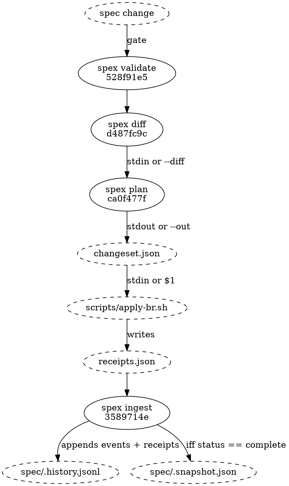
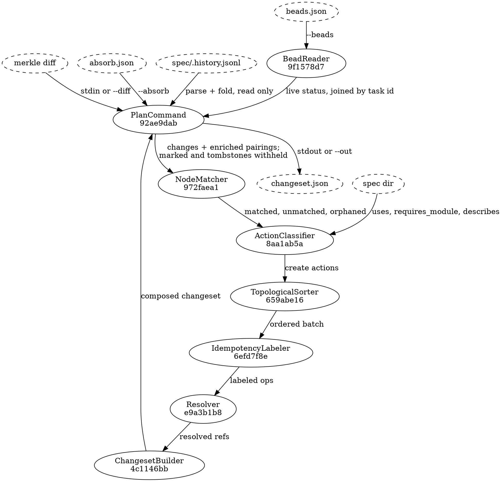

# Plan flow

## Position in the pipeline

Plan sits third in a five-stage run, and it is the stage that has to be right
about both of its neighbours: it consumes the diff document `spex diff` writes,
and the changeset it writes is a contract the adapter executes and `spex ingest`
reconciles. Every hand-off from `spex diff` onwards goes through a file, so each
of those stages can be re-run from the artifact its predecessor wrote.
`spex validate` is the exception — it is a gate, not a producer, and `spex diff`
reads only `--snapshot`, `--spec-dir` and the journal beside the snapshot — so
restarting at `diff` means re-reading the spec directory, not a validate
artifact.



Four of the five stages are surfaces this binary declares; the dashed adapter
runs outside it, and the reference adapter is one implementation of the adapter
contract rather than the contract itself. "spec change" is whatever
`project.json`, `module.json` and the markdown leaves now say. The changeset is
the decision document — reviewed in a git diff before the adapter executes it,
which is what supports the supervised spec change workflow now that no
intermediate report exists between the diff and the ops.

A partial run — any op with `status: error` in the receipts — leaves the
snapshot untouched, so the next `spex diff` recomputes from the same baseline
and the next plan run sees only the ops that never landed.

## Plan internals

One invocation, `spex plan --proposal <ref> --git-head <sha> [--diff <file>]
[--beads <file>] [--absorb <file>]`, runs eight steps in this order and writes
one file:



1. **Load the inputs.** [[92ae9dab6d6d|PlanCommand]] reads the diff from stdin
   or `--diff` and refuses it if its `errors` array is non-empty, parses the
   task journal — folding it and, from the same events, resolving the run's
   registration — loads the spec directory, and takes the git HEAD SHA from
   `--git-head` rather than asking git for it. It also parses the absorb list,
   refuses any mark on a node that is not `modified` in the diff, withholds
   every validly marked change from the stream the next steps see, and
   composes the absorbed entries off the withheld diff entries — absorption is
   settled here, before any pairing or status is consulted.
2. **Join the tracker's view.** [[9f1578d7af6d|BeadReader]] parses the `--beads`
   listing — the only tracker state in the run, a file the caller supplied,
   never a command this binary ran — and each bead's live status is joined onto
   the fold's pairing whose task id matches, in memory on the way past: this
   flow reads `spec/.history.jsonl` and never writes it.
3. **Match.** [[972faea162a6|NodeMatcher]] joins the enriched pairings to the
   diff's changes on identity hash and splits the result three ways.
4. **Classify.** [[8aa1ab5ac102|ActionClassifier]] turns the three lists into
   create, obsolete and retarget actions, consulting the spec directory for
   what the diff cannot tell it — how many components a test_section describes,
   which nodes a task should depend on, and the readable name to put against an
   identity hash. A claimed (`in_progress`) task whose node changed refuses the
   run here, exit 2.
5. **Order.** [[659abe167891|TopologicalSorter]] partitions the create actions
   by tier — the proposal epic, then components and data_flows, then
   multi-component test sections — and runs Kahn's algorithm inside each tier
   with a lex tiebreak on `spec_node_id`. The op ids, and the
   spec_node_id-to-op_id map the later steps need, are assigned from that order
   by ChangesetBuilder once the retarget and close ops have been counted.
6. **Label.** [[6efd7f8ebdb2|IdempotencyLabeler]] answers with one label per
   create action — `spex:<eid>` of the journal event the op's `task_created`
   will reference: fresh and modify-pair creates key the change event derived
   from `(git_head, op_id)`, a cleanup keys the journal's latest `removed`
   event for the node, read from the fold, when the removal already landed —
   else the event its same-batch close implies — and an epic keys the
   proposal's `registered` event read from the run's registration. A retarget's
   event label follows the same derivation and rides in its `labels` array.
7. **Resolve the references.** [[e9a3b1b85953|Resolver]] writes each dep —
   create and retarget alike — as `ref:op` or `ref:bead` (an unresolvable dep
   is a plan error, not a deferred shape), points every non-epic create's
   parent at the proposal epic, and walks implements → preq_id → priority for
   each create's priority number.
8. **Compose and write.** [[4c1146bb7287|ChangesetBuilder]] assembles the
   create ops, appends the retarget ops and one close op per obsoleted bead —
   target and reason alone, no labels — writes the
   absorbed entries PlanCommand composed into the top-level `absorbed` array,
   and answers with the finished v3 changeset in canonical field order.
   [[92ae9dab6d6d|PlanCommand]] writes that answer to stdout, or atomically to
   `--out` — the builder composes the document, the command owns the sink.

Steps 5 and 6 come before step 7 for a reason: a dep can only be written as
`ref:op` once the op it points at has an op_id — and a label can only be derived
once the op id it embeds is assigned. Ordering settles for the batch as a whole
before the first ref is written; labelling runs per action, each op's label
derived from that same op's own referent event.

## Data Shapes

### merkle diff (input)

The diff document exactly as the merkle module defines it: a `changes` array of
ClassifiedChange (see merkle/flow_diff_classification.md) and an `errors` array
that must be empty for the run to proceed. NodeMatcher forwards `impl_only`,
`contract`, and `arch_impl` changes and skips `structural` ones (module.json,
project.json, requirement leaves). Contract-level changes are forwarded — not
skipped — but the two node types merkle classifies as contract-level fare
differently past the gate: a data_flow gets a dedicated task bead, while an api
yields none.

### BeadReader → NodeMatcher

One entry per bead, each carrying two things and no more: the tracker's own
bead id (`spexmachina-abc` and the like) and the bead's live status exactly as
the input reported it. No label is read: the fold's pairing already carries the
task id its receipt recorded, so each entry's status is copied onto the journal
fold's pairing whose task id matches, and it is those enriched pairings —
carrying a `bead_status` alongside the node key they already held — that reach
NodeMatcher. Pairings for which no bead was supplied arrive with that status
unset, and a bead the fold never names joins nothing.

### NodeMatcher → ActionClassifier

Three lists, not one:

  - **matched**: a change paired with every pairing storing its identity hash —
    a spec node may carry more than one bead across its lineage
  - **unmatched**: an added or modified change no pairing refers to, on its
    own — a removed change no pairing refers to reaches none of the three lists
  - **orphaned**: a pairing whose spec node the diff reports as removed, carried
    with the node type of that removed change, because an identity hash does
    not embed one

Gating rules applied by ActionClassifier to unmatched changes:

| node_type | admitted by the gate? |
|-----------|-----------------------|
| module | yes, but no change ever carries this node type, so the entry is dead |
| component | yes (feature) |
| data_flow | yes |
| api | no — declared external surface; the components in its `provided_by` array carry the work |
| test_section, len(describes) >= 2 | yes (task) |
| test_section, len(describes) == 1 | no (bundled with that component's feature bead) |
| test_section, coupling not establishable | yes — no graph reached the gate, the module name does not resolve, or the section is not declared in the module it resolves to; coupling that cannot be established is admitted rather than dropped |
| meta, requirement | no — filtered upstream by NodeMatcher's `structural` skip, so the gate never sees one |

### ActionClassifier → the builder chain

One flat list of actions — type `create`, `obsolete` or `retarget`, each
carrying the fields the classifier leaf tabulates: module and node names, the
node type, the identity hash, content hashes, the old bead id where lineage
applies, `DepSpecNodeIDs` on creates and retargets, and one human-readable
reason. These are spec-graph ids, never bead ids; resolving them into refs is
the Resolver's work three steps later in the same process — the list crosses no
file boundary and no command seam.

### Journal reads (input)

The run reads the task journal and writes nothing back to it:

- the fold's pairing for a spec node — the matching join key, the `ref:bead`
  classification, the closed-dep drop, and the open/in_progress/closed status
  split once the `--beads` join has run. A removed node's entry is not one of
  these: it is withheld from matching and from the Resolver's lookup alike, per
  [[92ae9dab6d6d|PlanCommand]]'s pre-flight, so no tombstone can match a re-added
  node or parent a live op;
- the fold's `removed` event for a spec node, for a cleanup create whose
  removal landed in an earlier batch — the label it carries is that event's
  eid, so the cleanup answers the same removal across runs;
- the run's registration — the proposal's `registered` event, the epic's label
  and referent — resolved from the parsed events rather than the fold, plus any
  epic task the fold already pairs with it, for parent resolution; a proposal
  with neither an epic pairing nor a registration is a plan error naming the
  slug.

Nothing else is read: every other label derives from the op itself, and
appending to the journal is ingest's job once the adapter's receipts say a task
was actually made or moved.

### changeset.json (output)

```json
{
  "version": 3,
  "git_head": "deadbeef...",
  "proposal": "2026-08-13-plan-module",
  "ops": [
    {
      "op_id": "op-1",
      "type": "create",
      "spec_node_kind": "proposal_epic",
      "spec_node_id": "2026-08-13-plan-module",
      "idempotency": { "label": "spex:beef0001:2026-08-13-plan-module" },
      "priority": 3,
      "title": "Proposal: 2026-08-13-plan-module"
    },
    {
      "op_id": "op-2",
      "type": "create",
      "spec_node_kind": "component",
      "spec_node_id": "4c1146bb7287",
      "idempotency": { "label": "spex:deadbeef:op-2" },
      "parent": { "ref": "op", "op_id": "op-1" },
      "priority": 1,
      "title": "plan: ChangesetBuilder",
      "body": "…"
    },
    {
      "op_id": "op-3",
      "type": "retarget",
      "spec_node_id": "9f1578d7af6d",
      "spec_hash": "bbb...",
      "deps": [ { "ref": "op", "op_id": "op-2" } ],
      "target": { "ref": "bead", "bead_id": "spexmachina-hun" },
      "labels": ["spex:deadbeef:op-3"],
      "reason": "Spec node modified (retarget): plan/BeadReader"
    }
  ],
  "absorbed": [
    { "node": "972faea162a6", "before": "aaa...", "after": "bbb...", "reason": "typo sweep, no contract section touched" }
  ]
}
```

The epic op has no `body` key, and its absence is the point: an empty body is
omitted from the document rather than written as `""`, and the proposal
reference has no content leaf on disk to describe. The component op beside it
carries one; the retarget op carries neither body nor title nor parent nor
priority, because the task it moves already has all four.

## Error Paths

- Diff carries `errors` → abort before folding the journal. Exit 1.
- A claimed (`in_progress`) task's node changed → abort naming every such task. Exit 2.
- An absorb entry marks a node that is not `modified` in the diff → abort naming the node. Exit 2.
- Cycle in in-batch deps → abort after sort. Exit 2.
- Dep neither in-batch nor in the fold → abort naming the spec_node_id. Exit 2.
- Missing project requirement in priority chain → default priority `3`, silently. No error, no warning, and nothing in the changeset marks the op.
- `--git-head` missing or malformed → pre-flight rejection before any processing. Exit 1.
