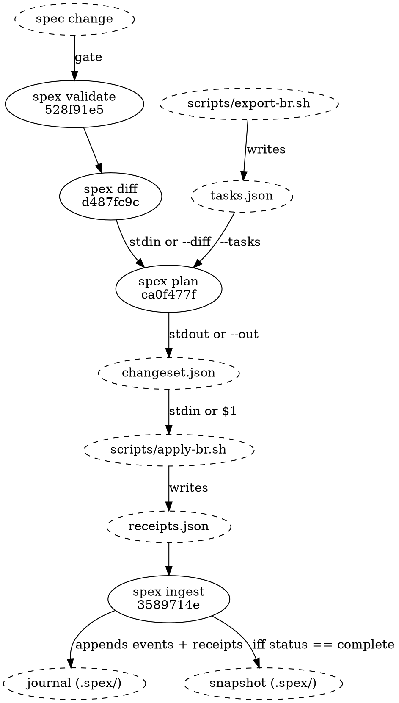
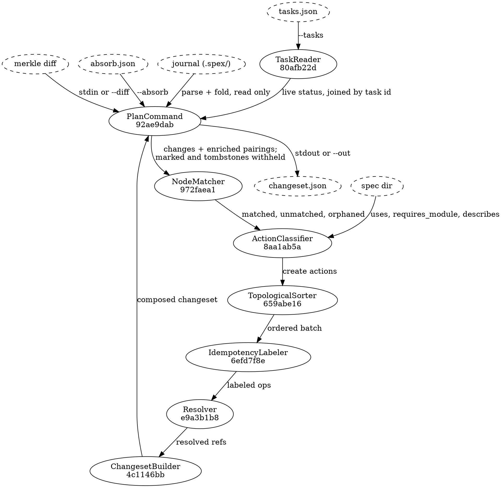

# Plan flow

## Position in the pipeline

Plan sits third in a five-stage run, and it is the stage that has to be right
about both of its neighbours: it consumes the diff document `spex diff` writes,
and the changeset it writes is a contract the adapter executes and `spex ingest`
reconciles. Every hand-off from `spex diff` onwards goes through a file, so each
of those stages can be re-run from the artifact its predecessor wrote.
`spex validate` is the exception — it is a gate, not a producer, and `spex diff`
reads only `--snapshot`, `--spec-dir` and the journal beside the snapshot — so
restarting at `diff` means re-reading the spec directory, not a validate
artifact.

The adapter appears twice. Its export half runs before plan and writes the
task-state artifact plan reads; its apply half runs after plan and writes the
receipts ingest reads. The tracker is therefore read exactly once per cycle, by
the one component that owns its format, and nothing inside the binary ever
sees a tracker listing.



Four of the five stages are surfaces this binary declares; the dashed adapter
scripts run outside it, and the reference adapter is one implementation of the
adapter contract rather than the contract itself. "spec change" is whatever
`project.json`, `module.json` and the markdown leaves now say. The changeset is
the decision document — reviewed in a git diff before the adapter executes it,
which is what supports the supervised spec change workflow now that no
intermediate report exists between the diff and the ops.

A partial run — any op with `status: error` in the receipts — leaves the
snapshot untouched, so the next `spex diff` recomputes from the same baseline
and the next plan run sees only the ops that never landed.

## Plan internals

One invocation, `spex plan --proposal <ref> --git-head <sha> --tasks <file>
[--diff <file>] [--absorb <file>]`, runs eight steps in this order and writes
one file:



1. **Load the inputs.** [[92ae9dab6d6d|PlanCommand]] reads the diff from stdin
   or `--diff` and refuses it if its `errors` array is non-empty, parses the
   task journal — folding it and, from the same events, resolving the run's
   registration — loads the spec directory, and takes the git HEAD SHA from
   `--git-head` rather than asking git for it. It also parses the absorb list,
   refuses any mark on a node that is not `modified` in the diff, withholds
   every validly marked change from the stream the next steps see, and
   composes the absorbed entries off the withheld diff entries — absorption is
   settled here, before any pairing or status is consulted.
   The resolved profile's plan-relevant list is read here too — the
   classifier's gate consults it for membership and the builder for the
   layer order.
2. **Join the tracker's view.** [[80afb22dab75|TaskReader]] validates and parses
   the `--tasks` artifact — the only tracker state in the run, a file the
   adapter's export half wrote, never a command this binary ran — and each
   listed task's live status is joined onto the fold's pairing whose task id
   matches, in memory on the way past: this flow reads the journal at its
   resolved location and never writes it. A pairing the artifact does not list
   joins no status, and that absence is what the next steps read as "finished".
3. **Match.** [[972faea162a6|NodeMatcher]] joins the enriched pairings to the
   diff's changes on identity hash and splits the result three ways.
4. **Classify.** [[8aa1ab5ac102|ActionClassifier]] turns the three lists into
   create, close and retarget actions — two decisions on the one bounded input —
   consulting the spec directory for what the diff cannot tell it: how many
   components a test_section describes, which nodes a task should depend on,
   and the readable name to put against an identity hash. A claimed
   (`in_progress`) task whose node changed or was removed refuses the run
   here, exit 2.
5. **Order.** [[659abe167891|TopologicalSorter]] partitions the create actions
   into layers — the proposal epic, then one layer per kind in the profile's
   plan-relevant order (data_flows, then components, then multi-component test
   sections under the default), then cleanups — and runs Kahn's algorithm
   inside each layer with a lex tiebreak on `spec_node_id`, refusing a kind the
   list does not place and a dep that points at a later layer. The op ids, and
   the spec_node_id-to-op_id map the later steps need, are derived by
   ChangesetBuilder from each op's canonical key — its kind and the node or
   task it acts on — never from its position.
6. **Label.** [[6efd7f8ebdb2|IdempotencyLabeler]] answers with one label per
   create action — `spex:<eid>` of the journal event the op's `task_created`
   will reference: every node-bearing create keys the change event derived
   from `(git_head, op_id)`, a cleanup keys the journal's latest `removed`
   event for the node when that is the node's latest state — else the
   `removed` event it will itself mint, from its own `(git_head, op_id)` — and
   an epic keys the proposal's `registered` event read from the run's
   registration. A retarget's event label follows the same derivation and
   rides in its `labels` array.
7. **Resolve the references.** [[e9a3b1b85953|Resolver]] writes each dep —
   create and retarget alike — as `ref:op` or `ref:task` (a finished task's dep
   is dropped; an unresolvable dep is a plan error, not a deferred shape),
   points every non-epic create's parent at the proposal epic, and walks
   implements → preq_id → priority for each create's priority number.
8. **Compose and write.** [[4c1146bb7287|ChangesetBuilder]] assembles the
   create ops — adding to each the layer edges, every create of the previous
   non-empty layer as `ref:op`, and to each cleanup every retarget's target as
   `ref:task` — appends the retarget ops and one close op per close action —
   target and reason alone, no labels — writes the
   absorbed entries PlanCommand composed into the top-level `absorbed` array,
   and answers with the finished v4 changeset in canonical field order.
   [[92ae9dab6d6d|PlanCommand]] writes that answer to stdout, or atomically to
   `--out` — the builder composes the document, the command owns the sink.

Steps 5 and 6 come before step 7 for a reason: a dep can only be written as
`ref:op` once the op it points at is known to precede it in the file, and the
layer edges exist only once the layers do. Ordering settles for the batch as a
whole before the first ref is written; labelling runs per action, each op's
label derived from that same op's own referent event, whose op_id is the op's
canonical key.

## Data Shapes

### merkle diff (input)

The diff document exactly as the merkle module defines it: a `changes` array of
ClassifiedChange (see merkle/flow_diff_classification.md) and an `errors` array
that must be empty for the run to proceed. NodeMatcher forwards `impl_only`,
`contract`, and `arch_impl` changes and skips `structural` ones (module.json,
project.json, requirement leaves). Contract-level changes are forwarded — not
skipped — but the two node types merkle classifies as contract-level fare
differently past the gate: a data_flow gets a dedicated task, while an api
yields none.

### tasks.json (input)

The version-1 task-state artifact the schema module's TaskStateSchema declares:

```json
{"version": 1, "tasks": [{"task_id": "spexmachina-hun", "status": "open"}]}
```

In-flight tasks only, `open` or `in_progress`; an empty `tasks` array is the
explicit nothing-in-flight. It is required, bounded by work in progress, and
spex's own format — the adapter's export half projects the tracker onto it, and
a raw tracker listing is refused as any other malformed document would be.

### TaskReader → NodeMatcher

One entry per listed task, each carrying two things and no more: the tracker's
own task id (`spexmachina-abc` and the like) and the task's live status exactly
as the input spelled it. No label is read: the fold's pairing already carries the
task id its receipt recorded, so each entry's status is copied onto the journal
fold's pairing whose task id matches, and it is those enriched pairings —
carrying a live status alongside the node key they already held, or no status
when the artifact omits the task — that reach NodeMatcher. A listed task the
fold never names joins nothing.

### NodeMatcher → ActionClassifier

Three lists, not one:

  - **matched**: a change paired with every pairing storing its identity hash —
    a spec node may carry more than one task across its lineage
  - **unmatched**: an added or modified change no pairing refers to, on its
    own — a removed change no pairing refers to reaches none of the three lists
  - **orphaned**: a pairing whose spec node the diff reports as removed, carried
    with the node type of that removed change, because an identity hash does
    not embed one

Gating rules applied by ActionClassifier to unmatched changes:

| node_type | admitted by the gate? |
|-----------|-----------------------|
| module | yes, but no change ever carries this node type, so the entry is dead |
| component | yes (feature) |
| data_flow | yes |
| api | no — declared external surface; the components in its `provided_by` array carry the work |
| test_section, len(describes) >= 2 | yes (task) |
| test_section, len(describes) == 1 | no (bundled with that component's feature task) |
| test_section, coupling not establishable | yes — no graph reached the gate, the module name does not resolve, or the section is not declared in the module it resolves to; coupling that cannot be established is admitted rather than dropped |
| meta, requirement | no — filtered upstream by NodeMatcher's `structural` skip, so the gate never sees one |

### ActionClassifier → the builder chain

One flat list of actions — type `create`, `close` or `retarget`, each
carrying the fields the classifier leaf tabulates: module and node names, the
node type, the identity hash, content hashes, the existing task id on a close or
retarget, `DepSpecNodeIDs` on creates and retargets, and one human-readable
reason. These are spec-graph ids, never task ids; resolving them into refs is
the Resolver's work three steps later in the same process — the list crosses no
file boundary and no command seam. No action carries a prior task id on a
create: there is no lineage to carry.

### Journal reads (input)

The run reads the task journal and writes nothing back to it:

- the fold's pairing for a spec node — the matching join key, the `ref:task`
  classification, the finished-dep drop, and the open/in_progress/absent
  split once the `--tasks` join has run. A removed node's entry is not one of
  these: it is withheld from matching and from the Resolver's lookup alike, per
  [[92ae9dab6d6d|PlanCommand]]'s pre-flight, so no tombstone can match a re-added
  node or parent a live op;
- the node's latest change event, for a cleanup create whose removal landed in
  an earlier batch — when that event is a `removed` one, the label the cleanup
  carries is its eid, so the cleanup answers the same removal across runs;
- the run's registration — the proposal's `registered` event, the epic's label
  and referent — resolved from the parsed events rather than the fold, plus any
  epic task the fold already pairs with it, for parent resolution; a proposal
  with neither an epic pairing nor a registration is a plan error naming the
  slug.

Nothing else is read: every other label derives from the op itself, and
appending to the journal is ingest's job once the adapter's receipts say a task
was actually made, moved or cancelled.

### changeset.json (output)

```json
{
  "version": 4,
  "git_head": "deadbeef...",
  "proposal": "2026-08-31-task-lifecycle",
  "ops": [
    {
      "op_id": "op-proposal_epic-2026-08-31-task-lifecycle",
      "type": "create",
      "spec_node_kind": "proposal_epic",
      "spec_node_id": "2026-08-31-task-lifecycle",
      "idempotency": { "label": "spex:beef0001:2026-08-31-task-lifecycle" },
      "priority": 3,
      "title": "Proposal: 2026-08-31-task-lifecycle"
    },
    {
      "op_id": "op-component-4c1146bb7287",
      "type": "create",
      "spec_node_kind": "component",
      "spec_node_id": "4c1146bb7287",
      "idempotency": { "label": "spex:deadbeef:op-component-4c1146bb7287" },
      "parent": { "ref": "op", "op_id": "op-proposal_epic-2026-08-31-task-lifecycle" },
      "priority": 1,
      "title": "plan: ChangesetBuilder",
      "body": "…"
    },
    {
      "op_id": "op-retarget-80afb22dab75",
      "type": "retarget",
      "spec_node_id": "80afb22dab75",
      "spec_hash": "bbb...",
      "deps": [ { "ref": "op", "op_id": "op-component-4c1146bb7287" } ],
      "target": { "ref": "task", "task_id": "spexmachina-hun" },
      "labels": ["spex:deadbeef:op-retarget-80afb22dab75"],
      "reason": "Spec node modified (retarget): plan/TaskReader"
    }
  ],
  "absorbed": [
    { "node": "972faea162a6", "before": "aaa...", "after": "bbb...", "reason": "typo sweep, no contract section touched" }
  ]
}
```

The epic op has no `body` key, and its absence is the point: an empty body is
omitted from the document rather than written as `""`, and the proposal
reference has no content leaf on disk to describe. The component op beside it
carries one; the retarget op carries neither body nor title nor parent nor
priority, because the task it moves already has all four. Every ref is a
discriminator and one id — `ref:op` with `op_id`, `ref:task` with `task_id` —
and nothing else.

## Error Paths

- Diff carries `errors` → abort before folding the journal. Exit 1.
- `--tasks` missing, unreadable, or failing the task-state schema → abort before matching. Exit 1.
- A claimed (`in_progress`) task's node changed or was removed → abort naming every such task. Exit 2.
- An absorb entry marks a node that is not `modified` in the diff → abort naming the node. Exit 2.
- Cycle in in-batch deps → abort after sort. Exit 2.
- A create whose kind the profile's plan-relevant list does not place → abort naming the kind. Exit 2.
- A spec-graph dep pointing at a later layer's op → abort naming both ops. Exit 2.
- An empty plan-relevant list → a warning on stderr that no node type produces tasks and an adapter run would create none; the run proceeds. Exit 0.
- Dep neither in-batch nor in the fold → abort naming the spec_node_id. Exit 2.
- Missing project requirement in priority chain → default priority `3`, silently. No error, no warning, and nothing in the changeset marks the op.
- `--git-head` missing or malformed → pre-flight rejection before any processing. Exit 1.
