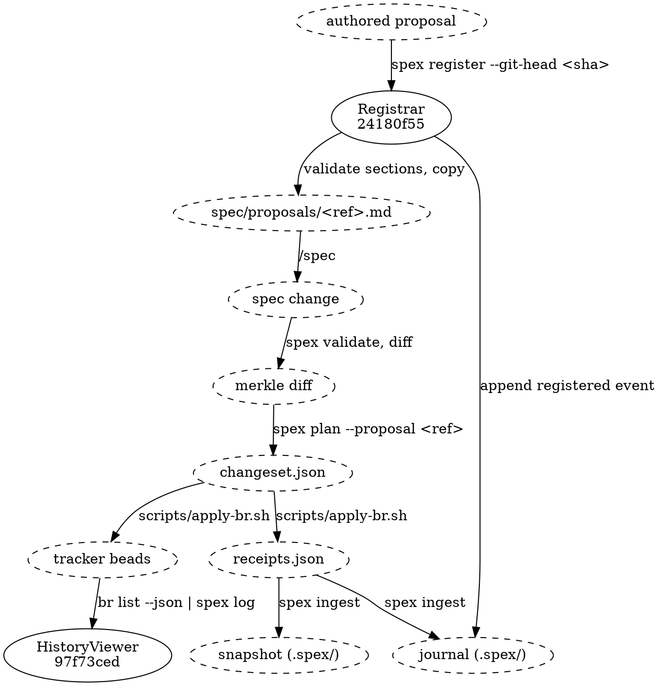

# Proposal Lifecycle Flow

## Data Flow

Only the two solid nodes are spec nodes: [[24180f55c0b4|Registrar]] opens the lifecycle and
[[97f73ced5a02|HistoryViewer]] closes it. Everything dashed sits outside this module — the proposal
a human or an LLM authored, the spec files `/spec` edits (`project.json`, `module.json`, `*.md`),
the diff, changeset and receipts the middle of the pipeline writes, and the beads themselves, which live in
whatever tracker the user runs. Two of those artifacts carry more than their name says:
`changeset.json` leads with the proposal-epic create op and follows it with the ordered bead ops,
and `receipts.json` carries a bead id for every op the adapter actually executed. Two steps leave
two marks rather than one. Registration writes the proposal copy and appends the `registered`
event — through the map module's MappingStore, the journal's writer-owner — whose
`<git_head>:<slug>` eid is what the epic's `task_created` will reference. And `spex ingest`
appends to the task journal, and on a run the adapter
reported complete it also rebaselines the snapshot — the baseline the next `spex diff`
measures against, so a partial run deliberately leaves the old one standing.

The closing edge is a pipe, not a file read. HistoryViewer never opens the journal or the
snapshot: the beads reach it as JSON on stdin, read and parsed by the command that fronts it, which
is why the tracker sits on that edge and the two files `spex ingest` wrote sit off to the side of
it.

## Key Insight

The proposal module is a bookend: registration happens before the spec change,
history viewing happens after. The middle steps — spec authoring, diff, plan,
adapter execution, ingest — are handled by other modules and by the
adapter outside the binary. The proposal reference threads through the entire
chain: `spex plan --proposal <ref>` stamps it on the changeset, the changeset's
first op creates the proposal epic bead, and every other op in the batch is
parented under that epic. That parentage is what HistoryViewer walks back.

## Traceability Chain

Each step is derived from the one before it, and each derivation is recorded:

1. A conversation produces a proposal.
2. Registration records two marks: the file under `spec/proposals/` and the `registered` journal
   event opening the lifecycle.
3. The proposal drives a spec change.
4. The spec change produces a merkle diff.
5. The diff produces a changeset.
6. The changeset, executed, produces receipts.
7. The receipts produce beads and their journal events.

Any point in this chain can be traced forward or backward. The proposal is the
anchor point that explains "why" a change was made; the changeset and receipts
are the durable record of "what was actually executed", so the trail survives
even a partial adapter run.

## Data Shapes

### Proposal file on disk (spec/proposals/YYYY-MM-DD-name.md)

- Markdown document with required H1 heading `# Change Proposal: <title>`
- Required H2 sections (validated by Registrar): `Context`, `Proposed change`,
  `Impact expectation`
- Optional H2 sections: any — treated as freeform

### Registrar → HistoryViewer coupling

Registrar and HistoryViewer share no record type and no index file — they are
coupled only by a filesystem naming convention on the proposal's stem
(`YYYY-MM-DD-name`, `.md` stripped):

- Registrar (`spex register`) copies the proposal to
  `spec/proposals/<stem>.md`. `<stem>` is the source filename if it already
  matches the dated convention, otherwise today's date plus a slug of the H1
  heading. Beyond the copy, the only other mark is the `registered` journal
  event keyed on that same stem — no timestamp, no title, no path is recorded
  anywhere, and HistoryViewer reads neither the journal nor anything else
  Registrar wrote beyond the file.
- HistoryViewer (`spex log`) never reads anything Registrar wrote beyond that
  file: it groups beads by the `spec_proposal:<stem>` label already on each
  bead, then re-opens `spec/proposals/<stem>.md` at render time to read the
  title from the H1 heading. A stem with no matching file is still rendered,
  annotated "proposal file missing".

### Proposal reference (pipeline-wide contract)

- string of the form `YYYY-MM-DD-name` (matches the filename stem)
- Passed as the required `--proposal <ref>` flag to `spex plan`, which copies it
  into the changeset's top-level `proposal` field
- Carried by the proposal-epic create op: `spec_node_kind = "proposal_epic"`,
  `spec_node_id` = the reference itself (not an identity hash), title
  `"Proposal: <ref>"`. The op's idempotency label is `spex:<eid>` of the proposal's
  `registered` event, read from the journal fold, and ingest pairs the epic's `task_created`
  to that event through `for` — no spec-graph lookup, no side channel.
- Used by HistoryViewer (`spex log`) to group beads under the proposal

### HistoryViewer → stdout

- ProposalLog (`--json`):
  - proposals: list, one entry per `spec_proposal:` stem, in ascending stem order
    - filename: string — `<stem>.md`
    - title: string — the proposal file's H1, or empty when the file is missing
    - beads: list, in the order the input supplied them
      - id: string — the tracker bead id
      - status: string — the bead's status as the input reported it
      - action: string — `created` or `closed`, derived from that status
      - summary: string — the bead's title

Grouping reads the `spec_proposal:` label and nothing else. No epic bead id is
read or emitted, and the proposal epic plays no part in this rendering.
