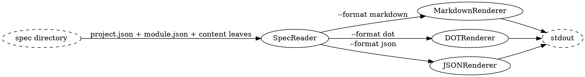

# Render Pipeline

## Data Flow



One invocation walks one of the three lower paths. The flags are settled before anything is read; [[7d1150c19724|SpecReader]] then runs once, and the format decides only which of [[b4b4eba6b551|MarkdownRenderer]], [[45331bdc0bd0|DOTRenderer]] and [[172d16ca0eac|JSONRenderer]] receives the parsed graph. Whichever one runs sees exactly what the other two would have seen, which is why a spec that will not parse is one failure rather than three format-specific ones.

## Subcommand Design

The render module is exposed as `spex render` with a `--format` flag:

```
spex render --format markdown    # collated spec document
spex render --format dot         # graphviz graph
spex render --format json        # machine-readable graph
spex render --format json --slim # nodes only, as a name→hash lookup table
```

Default format is `markdown`. `--slim` is a modifier on the json format and is refused with any other.

## Piping Examples

```bash
spex render --format dot | dot -Tpng > spec.png
spex render --format json | jq '.nodes[] | select(.type == "component")'
spex render --format json --slim | jq -r '.nodes[] | "\(.name)\t\(.id)"'
spex render --format markdown > spec.md
```

## Data Shapes

### SpecReader → renderers (the parsed graph)

What crosses this boundary is one value, built once and read by exactly one renderer:

- the project envelope, as `spec/project.json` declares it — name, description, requirements, module
  declarations and sections
- one entry per declared module, in `project.json` declaration order, each carrying that module's
  declaration from `project.json`, everything its `module.json` declares, and the text of every
  content file it named
- content keyed by the relative path the declaring node wrote in its `content` field — the same
  string, not a resolved or absolute one

Every node carries its 12-char hex identity hash in its `id` field, and edges are kept as identity-hash
references. There is no by-id index over the graph: a renderer that needs an edge's target scans the
declarations it already holds. Nothing is read from disk after this point, so a renderer can inline
only what the reader put here — a node type the reader drops is invisible to all three formats at once.

### Renderers → stdout (format envelope)

- MarkdownRenderer: a single UTF-8 document, project scope first and then one block per module.
- DOTRenderer: a single `digraph` block. Node IDs are identity hashes and labels are node names, so a
  hand-written diagram and a generated one name the same node by the same string. Edge kinds
  (`implements`, `uses`, `describes`, `provided_by`, `requires_module`, `preq_id`, `depends_on`,
  `coupled`) become DOT edge attributes.
- JSONRenderer:
  - nodes: list of {id, type, name} plus description, content, module and group where the declaration
    carries them
  - edges: list of {from, to, type}
  - under `--slim`: nodes only, each {id, type, name, module}, and no edges list at all

### Shape contract

Field renames, additions, or removals in the parsed graph require updates to all renderers. A new
spec node type requires matching handling in all three render formats — a type the reader surfaces
and a renderer ignores is dropped silently, since there is no missing file for anything to report.
