# Validation Pipeline

## Data Flow

```dot
digraph validation_pipeline {
    "spec directory"        [style=dashed];
    "651d5315eebf"          [label="SchemaChecker\n651d5315"];
    "5dcca0dab9bd"          [label="ContentResolver\n5dcca0da"];
    "link check"            [style=dashed];
    "00beeeda5ddd"          [label="IDValidator\n00beeeda"];
    "id_derivation check"   [style=dashed];
    "c6c770a59d68"          [label="DAGChecker\nc6c770a5"];
    "88dd4060cb44"          [label="NameConsistencyChecker\n88dd4060"];
    "ed7a40b68995"          [label="TestCoverageChecker\ned7a40b6"];
    "c7d0282b0e05"          [label="RequirementCoverageChecker\nc7d0282b"];
    "e36112523589"          [label="CoupledSectionChecker\ne3611252"];
    "0f98ca780873"          [label="ErrorReporter\n0f98ca78"];
    "JSON report on stdout" [style=dashed];

    "spec directory" -> "651d5315eebf"        [label="1. schema"];
    "spec directory" -> "5dcca0dab9bd"        [label="2. content"];
    "spec directory" -> "link check"          [label="3. link"];
    "spec directory" -> "00beeeda5ddd"        [label="4. id"];
    "spec directory" -> "id_derivation check" [label="5. id_derivation"];
    "spec directory" -> "c6c770a59d68"        [label="6. dag"];
    "spec directory" -> "88dd4060cb44"        [label="7. name_consistency"];
    "spec directory" -> "ed7a40b68995"        [label="8. test_coverage"];
    "spec directory" -> "c7d0282b0e05"        [label="9. requirement_coverage"];
    "spec directory" -> "e36112523589"        [label="10. coupled_section"];

    "651d5315eebf"        -> "0f98ca780873";
    "5dcca0dab9bd"        -> "0f98ca780873";
    "link check"          -> "0f98ca780873";
    "00beeeda5ddd"        -> "0f98ca780873";
    "id_derivation check" -> "0f98ca780873";
    "c6c770a59d68"        -> "0f98ca780873";
    "88dd4060cb44"        -> "0f98ca780873";
    "ed7a40b68995"        -> "0f98ca780873";
    "c7d0282b0e05"        -> "0f98ca780873";
    "e36112523589"        -> "0f98ca780873";

    "0f98ca780873" -> "JSON report on stdout" [label="sorted by path"];
}
```

The edge labels number the ten checks in the order the command runs them, and the label on
each is the value that check writes into an entry's `check` field. The nine solid nodes are
the components this flow is made of; dashed are the directory the run is pointed at, the
document it produces, and the two checks — `link` and `id_derivation` — that run in the same
sequence but that this module declares no component for.

[[651d5315eebf|SchemaChecker]] validates `project.json` and each `module.json` against the
composed JSON Schemas. [[5dcca0dab9bd|ContentResolver]] asks whether every declared `content`
path resolves to a file, without opening any of them. [[00beeeda5ddd|IDValidator]] covers
identity-hash uniqueness, cross-reference targets, mandatory `preq_id` and `priority`
presence. [[c6c770a59d68|DAGChecker]] walks every non-exempt reference kind the resolved profile
declares plus the frame's fixed `requires_module` edge — under the default, the module,
requirement (both scopes) and component dependency graphs — looking for cycles. [[88dd4060cb44|NameConsistencyChecker]] compares each module's
name in `project.json` against the name its own `module.json` declares.

[[ed7a40b68995|TestCoverageChecker]] reports a component that no `test_section` describes,
and [[c7d0282b0e05|RequirementCoverageChecker]] reports a project requirement nothing derives
from and a module requirement nothing implements — except a project requirement declaring
`derivation: pending`, whose underived state it emits as a disclosure note in the error's
place. [[e36112523589|CoupledSectionChecker]] validates the `sections` envelope and hands a
coupled section's freeform content to the coupled module's own section schema. Last,
[[0f98ca780873|ErrorReporter]] checks nothing at all: it takes the accumulated entries and the
accumulated notes, sorts the entries by path, and writes the single JSON document that reaches
stdout.

## Execution Order

Ten checks run in sequence, not in parallel, in exactly the order the diagram's edge labels number. That order governs when a check runs, not where its entries land in the report. ErrorReporter sorts the aggregated entries by path and by nothing else, which scatters one check's entries among another's, and leaves entries that share a path tied under that comparison — the sort makes no promise about tied entries. So a spec whose `render/module.json` will not parse yields ten entries, every one of them located at `render/module.json`. Read the `check` field to tell them apart, not the position.

Schema validation leads because the structural checks are meaningless on unparseable JSON. But no check short-circuits the sequence — all ten run even when earlier ones report errors, so a single run produces the full report rather than one failure at a time. A check that cannot load the spec returns that load failure under its own name rather than staying silent, so a malformed file surfaces from the check that met it.

## Error Accumulation

Each check appends its entries to one shared list. No check short-circuits on entries from previous checks. The final report contains all violations found across all checks.

Disclosure notes travel beside that list, never in it: `requirement_coverage` is today the only check that emits any, and its notes are accumulated separately and handed to ErrorReporter with the entries. A note is not a validation entry — it carries no severity, is counted by nothing, and moves no exit code.

## Data Shapes

### Checker input (the spec directory path)

- Every checker takes the resolved spec directory and nothing else. There is no
  shared parsed graph threaded between them: each loads `project.json` and the
  `module.json` files it needs for itself, reads them, and mutates nothing. The
  cost of re-reading is accepted in exchange for checkers that stay independent
  and individually testable.

### Checker output (appended to shared list)

- A validation entry has exactly five fields, and no others:
  - check: string — which check produced the entry. One of `schema`,
    `content`, `link`, `id`, `id_derivation`, `dag`, `name_consistency`,
    `test_coverage`, `requirement_coverage`, `coupled_section`
  - severity: string — always `error`. No check can construct any other
    value, so severity never discriminates between entries
  - path: string — location in the spec: a file path (`alpha/module.json`),
    or a file plus JSON pointer (`project.json:/modules/0/name`), whichever
    is more specific
  - message: string — human-readable one-line summary
  - schema_path: string — the JSON Schema path that was violated. Set by
    the two checks that judge a document against a JSON Schema: the
    `schema` check, and the `coupled_section` check on a content
    violation. Every other check leaves it empty

There is no `code`, no `node_id` and no `details` field. Identifying
information travels in `path` and `message`.

### ErrorReporter → stdout

- The report has four fixed fields, plus one that appears only when it has
  content:
  - valid: boolean — true when the sorted entry list is empty. Notes play no
    part in it
  - error_count: integer — the length of that list. Every entry counts,
    because every entry is an error; a note is not an entry and counts nowhere
  - warning_count: integer — always `0`. Nothing can produce a warning — a
    note is not a warning — and the field stays in the contract because gates
    and CI assert on it
  - errors: list of validation entries, sorted by path and by nothing else
  - notes: list of disclosures, present only when non-empty — a clean run
    emits the four-key document exactly as before. Each note carries `type`,
    `message` and `related`, the same three keys a `spex diff` note carries

There is no separate `warnings` list, no `checked_files` and no
`schema_version`.

Exit code: `0` if `valid == true`, `1` otherwise — read off the report the
reporter returns rather than re-derived from the list. Shape changes here
cascade into downstream consumers (CI pipelines, `spex diff` — which builds
the merkle tree on demand and assumes a validated spec — and skills that
parse the report).
